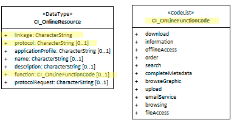

# OnlineResource ★★★★★

*Most metadata contains information about resources that are avaliable online. In order for machines and people to to retrieve such resources cited in a  Metadata record [MD_Metadata](./class-MD_Metadata) , a method of access must be provided.  CI_OnlineResources provides a standard way of describing such access wherever such is documented in a metadata record.*

| | |
| --- | --- |
| **Element Name** | *onlineResource* |
| **Parent** | *[MD_Metadata.identificationInfo>MD_Identificationcitation* |
| **Class/Type** | [*class - CI_OnlineResource*](class-CI_OnlineResource) |
| **Governance** | *Common ICSM, Agency, Domain* |
| **Purpose** | *Access* |
| **Audience** | machine resource - ⭑ ⭑ ⭑ ⭑ ⭑ |
| | general - ⭑ ⭑ ⭑ ⭑ ⭑ |
| | resource manager - ⭑ ⭑ ⭑ |
| | specialist - ⭑ ⭑ ⭑ |
| **Metadata type** | *administrative* |
| **ICSM Level of Agreement** | ⭑⭑⭑⭑ |

## Definition

**information about on-line sources from which the resource, specification, or community profile name and extended metadata elements can be obtained**

### ISO Obligation

- There can be zero to many [0..`*`] *onlineResource* entries for the cited resource in the *[MD_Identification.citation](./ResourceCitation)* package of class *[CI_OnlineResource*](class-CI_OnlineResource)* in a metadata record.  The resource may be of type Data *[MD_DataIdentification](./class-MD_DataIdentification)* or of type Service *[SV_ServiceIdentification].

## Discussion

For Services, the OnlineResource should provide the default location of a described service or possible its landing page. It should not link to the metadata record itself as there must be some place where the URL for access to the service itself is captured. 

This element may also be used when describe elements of Datset metadata not covered by other elements. in such cases the 
**function -** *(codelist - CI_OnlineFunctionCode)* code for function performed by the online resource should be populated. Options are:
  - downlaod -  online instructions for transferring data from one storage device or system to another
  - information - online information about the resource
  - offlineAccess - online instructions for requesting the resource from the provider
  - order - online order process for obtaining the resource
  - search - online search interface for seeking out information about the resource
  - completeMetadata - complete metadata provided
  - browseGraphic - browse graphic provided
  - upload - online resource upload capability provide
  - emailService - online email service provided
  - browsing - online browsing provided
  - fileAccess - online file access provided

## ICSM Best Practice Recommendations

Therefore - when describing an service, provide an authoritative linkage to this service or its landing page in

### ICSM Recommended Sub Element for class CI_OnlineResource

- **linkage -** (*type - charStr*) [1..1] Mandatory for class - location (address) for on-line access using a Uniform Resource Locator/Uniform Resource Identifier address or similar addressing scheme 
- **protocol -** *(type - charstr)* [0..1] recommended to document the connection type used. (http or https)

## Also Consider

- **[Resource Identifier](/ResourceIdentifier) -** May also hold the URL of the Service as a valid URI.
- **[Disrtibution Info](./DistributionInfo) -** Could also hold extended access information for a Service
- **[CI_OnlineResource*](class-CI_OnlineResource) -** The Class reference
- **[Resource Citation](./ResourceCitation)** - parent to this element

## Outstanding Issues

> **CORE ISSUE:**
In Service metatdata it is high importance that we agree on the methodology for recording the location (URL) of the Service described. *OnlineResouce* is the leading cndidate to hold this information. This information may be captured in other ways such as those listed in *Also Consider*. This issue need futher discussion by MDWG.

\pagebreak

### UML diagrams

Recommended elements highlighted in yellow

\pagebreak
