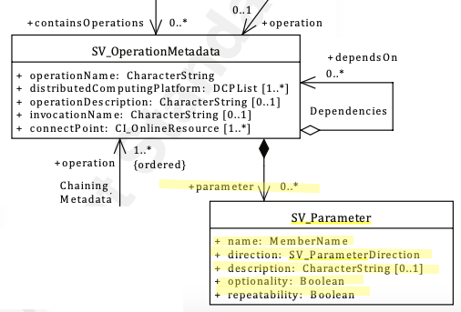

# Parameter ★★★ 

*Once a service operation has been discovered, potential users need to know the parameters that are required for this interface in sequence. Provision of the specifics of the operation parameters allows such evaluation and use.*

| | |
| --- | --- |
| **Element Name** | *parameter* |
| **Parent** | *[MD_Metadata.identificationInfo>SV_ServiceIdentification](./ServiceIdentification)* |
| **Class/Type** | *SV_Parameter* |
| **Governance** | *Domain, Agency* |
| **Purpose** | *Evaluation, Use* |
| **Audience** | machine resource - ⭑ ⭑ ⭑ ⭑ |
| | general - ⭑ ⭑|
| | resource manager - ⭑ ⭑ |
| | specialist - ⭑ ⭑ ⭑ ⭑ |
| **Metadata type** | *structural* |
| **ICSM Level of Agreement** | ⭑ ⭑ |

## Definition  
**the parameters that are required for a service operation interface, in sequence**

### ISO Requirements

This is an ISO optional element. There may be zero or many [0..\*] *parameter* instances of class *SV_Parameter* associated to service operation (*containsOperations*, class *SV_OperationMetadata*) entries for the cited resource. If parameter order is important, then these should be recorded in the proper sequence.

## Discussion  
It is useful when documenting a service to document the particular parameters that the service operations need and expect if any. This documentation must include the parameter technical details including *name*, *direction*, *optionality*, and *repeatability*. A description of the purpose of the parameter is useful for users to evaluate the utility of such operations.

As many of the services we may call will have operations that summarise the operations that the service provides it may be better to document this one service in order not to duplicate or cause confusion. GetCapabilities would be an example of this as would an OpenAPI endpoint as implemented in OGC API common based services. These operations typically require no parameters, but the operations they describe will contain the necessary parameters.

## ICSM Best Practice Recommendations 

Therefore - if a potential client of a service is to use such service, descriptions of the functionality and use of the parameters required by these operations should be documented in metadata of a geospatial service. When used, this element has several mandatory subelements as described below.

### Recommended Sub-Elements 

- **name -** *(class - MemberName)* [1..1] - Mandatory. The name, as used by the service for this parameter. 
- **direction -** *(codelist - SV_ParameterDirection)* [1..1] - Mandatory. Indication if the parameter is an input to the service, an output or both 
- **description -** *(type - charStr)* [0..1] - A narrative explanation of the role of the parameter
- **optionality -** *(type - Boolean)* [1..1] - Mandatory. Indication if the parameter is required (True or False)
- **repeatability -** *(type - Boolean)* [1..1] - Mandatory. Indication if more than one value of the parameter may be provided (True or False)


### Related Codelists

#### SV_ParameterDirection - codelist

When describing the service parameters, the *direction* for each parameter must be described from the *SV_ParameterDirection* codelist. Available values are:

* **in** - The parameter is an input parameter to the service instance
* **out** - The parameter is an output parameter to the service instance
* **in/out** - The parameter is both an input and output parameter to the service instance

## Outstanding Issues
None known

#### Other Discussion 

None known

## Crosswalk Considerations 

None known

## Examples

### XML -

```
<mdb:MD_Metadata>
....
  </mdb:identificationInfo>
    </srv:SV_ServiceIdentification>
    ....
     <srv:containsOperations>
     ....
        <srv:parameter>
          <srv:SV_Parameter>
           <srv:name>
             <gco:MemberName>
              <gco:aName>
                <gco:CharacterString>VERSION</gco:CharacterString>
              </gco:aName>
              <gco:attributeType>
                <gco:TypeName>
                 <gco:aName gco:nilReason="missing">
                   <gco:CharacterString/>
                 </gco:aName>
                </gco:TypeName>
              </gco:attributeType>
             </gco:MemberName>
           </srv:name>
           <srv:direction>
             <srv:SV_ParameterDirection>in</srv:SV_ParameterDirection>
           </srv:direction>
           <srv:description>
             <gco:CharacterString>Version of WFS. Accepted value = 1.0.0</gco:CharacterString>
           </srv:description>
           <srv:optionality>
             <gco:Boolean>true</gco:Boolean>
           </srv:optionality>
           <srv:repeatability>
                <gco:Boolean>false</gco:Boolean>
              </srv:repeatability>
             </srv:SV_Parameter>
           </srv:parameter>
           <srv:parameter>
             <srv:SV_Parameter>
              <srv:name>
                <gco:MemberName>
                 <gco:aName>
                   <gco:CharacterString>REQUEST</gco:CharacterString>
                 </gco:aName>
                 <gco:attributeType>
                   <gco:TypeName>
                    <gco:aName gco:nilReason="missing">
                      <gco:CharacterString/>
                    </gco:aName>
                   </gco:TypeName>
                 </gco:attributeType>
                </gco:MemberName>
              </srv:name>
              <srv:direction>
                <srv:SV_ParameterDirection>in</srv:SV_ParameterDirection>
              </srv:direction>
              <srv:description>
                <gco:CharacterString>REQUEST=GetCapabilities</gco:CharacterString>
              </srv:description>
              <srv:optionality>
                <gco:Boolean>false</gco:Boolean>
              </srv:optionality>
              <srv:repeatability>
                <gco:Boolean>false</gco:Boolean>
              </srv:repeatability>
             </srv:SV_Parameter>
           </srv:parameter>
           <srv:parameter>
             <srv:SV_Parameter>
              <srv:name>
                <gco:MemberName>
                 <gco:aName>
                   <gco:CharacterString>SERVICE</gco:CharacterString>
                 </gco:aName>
                 <gco:attributeType>
                   <gco:TypeName>
                    <gco:aName gco:nilReason="missing">
                      <gco:CharacterString/>
                    </gco:aName>
                   </gco:TypeName>
                 </gco:attributeType>
                </gco:MemberName>
              </srv:name>
              <srv:direction>
                <srv:SV_ParameterDirection>in</srv:SV_ParameterDirection>
              </srv:direction>
              <srv:description>
                <gco:CharacterString>SERVICE=WFS</gco:CharacterString>
              </srv:description>
              <srv:optionality>
                <gco:Boolean>false</gco:Boolean>
              </srv:optionality>
              <srv:repeatability>
                <gco:Boolean>false</gco:Boolean>
              </srv:repeatability>
          </srv:SV_Parameter>
        </srv:parameter>
       </srv:SV_OperationMetadata>
     </srv:containsOperations>
    </srv:SV_ServiceIdentification>
  </mdb:identificationInfo>
....
</mdb:MD_Metadata>
```

\pagebreak

### UML diagrams
{Captured from official ISO documentation at https://www.isotc211.org/hmmg/HTML/ConceptualModels/index.htm?goto=1:12:2:4095}
Recommended elements highlighted in yellow



\pagebreak

