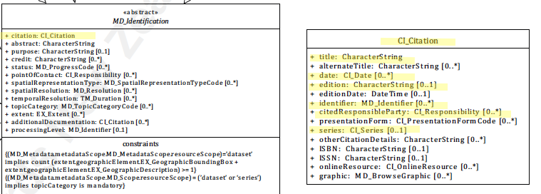

#  Service Citation ★★★★★
*Some of the most basic needs of users of a resource is citation information. This basic information includes title, edition, identifier, dates, responsible parties, etc. In ISO 19115-1 we capture this information in MD_identification.citation.*

|  |  |
| --- | --- |
| **Element Name** | *citation* |
| **Parent** |  *[MD_Metadata.identificationInfo>SV_ServiceIdentification](./ServiceIdentification)* |
| **Class/Type** | *CI_Citation* |
| **Governance** |  *Common ICSM, Agency, Domain* |
| **Purpose** | *Discovery, Identification* |
| **Audience** | machine resource - ⭑ ⭑ ⭑ |
|  | general - ⭑ ⭑ ⭑ ⭑ ⭑ |
|  | resource manager - ⭑ ⭑ ⭑ ⭑|
|  | specialist - ⭑ ⭑ ⭑ |
| **Metadata type** | *descriptive* |
| **ICSM Level of Agreement** | ⭑⭑⭑⭑ |

## Definition
**Citation information for the service.**

### ISO Obligation

There must be one and only one [1..1] *MD_Metadata.indentificationInfo>SV_ServiceIdentification.citation* package for the cited service in a metadata record. This must be of of class *[CI_Citation](./class-CI_Citation)*.

## Discussion

The citation package contains multiple elements from [CI_Citation](./class-CI_Citation). Only child elements contain content. Follow the links on the child elements above for further discussion. Aspects of the contents of this package may be governed at different levels.

## ICSM Recommendations

Therefore - In order for potential users to find and identify spatial resources, it is important that these be well cited with information that includes a minimum of `title`, `identifier`, `date` (of type `creation`, plus `revision` and `issued` when appropriate) and `citedResponsibleParty` (for `author` or `creator`, plus `publisher` and `contributor` when appropriate). 

Because many of the elements of `MD_Identification.citation` are mandatory and are important for identification and harvesting of metadata, it is recommended that the guidance provided in each of these six sub-elements (title, date, edition, identifier, citedResponsibleParty, and series) be followed. Other available [CI_Citation](./class-CI_Citation) elements should be used if needed to properly document your resource. Consult your metadata governance team on such use.

This element should be populated in all service metadata records. 

### Recommended Sub-Elements

Follow the general guidance for **[CI_Citation](./class-CI_Citation)** with emphasis on the following elements:
- **[title](./ResourceTitle) -** *(type - charStr)*[1..1] Mandatory - name by which the cited resource is known
- **[date](./ResourceDate) -** *(class - [CI_Date](./class-CI_Date))*  [0..\*]  reference date for the cited resource. Should include at a minimum, the creation date for the resource.
- **[edition](./ResourceEdition) -** *(type - charStr)* [0..1] version of the cited resource if appropriate
- **[identifier](./ResourceIdentifier) -** *(class - [MD_Identifier](./class-MD_Identifier))* [0..\*] value uniquely identifying an object within a namespace. Recommend provision of a resolvable URI following the MD_Identifier guidance.
- **[citedResponsibleParty](./ResourceResponsibleParty) -** *(class - CI_Responsibility)*[0..\*] roles, name, contact, and position information for an individual or organisation that is responsible for the resource. It is recommended that a party with the role "Point of Contact" be provided as well as an entry for "publisher".
- **[series](./ResourceSeries) -**  *(class - CI_Series)* [0..1] If needed, information about the series, or aggregate resource, of which the resource is a part should be included.
- **[onlineResource](./class-CI_OnlineResource) -** *class - [CI_OnlineResource](./class-CI_OnlineResource)* [0..\*] Highly Recommended. The URL Link for the landing page of the service. May also be recorded in *DistributionInfo* or *ResourceIdentifier*

#### Other Sub-Elements

- **alternateTitle -** *(type - charStr)* [0..\*] short name or other language name by which the cited service is known. Example: DCW as an alternative title for Digital Chart of the World. Recommended whenever there are alternate names commonly in use.
- **[series](./ResourceSeries) -**  *(class - CI_Series)* [0..1] If needed, information about the series, or aggregate resource, of which the resource is a part should be included.
- See *[CI_Citation](./class-CI_Citation)* for more options.

## Also Consider

- **[DistributionInfo -](./DistributionInfo)** Can contain information about how the service is distributed. like *onlineResource* should contain landing page linkages to the service but can also store additional information.
- **[metadataLinkage -](./MetadataLinkage)**  for links that provide a download of the metadata
- **[browseGraphic -](./BrowseGraphic)**  associates to a large number of packages to provide linkage to associated image files, such as business or product icons and logos

## Examples

<details>

### XML
Note - change to service example
```
<mdb:MD_Metadata>
....
  <mdb:identificationInfo>
      <srv:SV_ServiceIdentification>
         <mri:citation>
            <cit:CI_Citation>
               <cit:title>
                  <gco:CharacterString>Sample service metadata 2020-05-28</gco:CharacterString>
               </cit:title>
               <cit:date>
                  <cit:CI_Date>
                     <cit:date>
                        <gco:DateTime>2019-09-01T00:00:00</gco:DateTime>
                     </cit:date>
                     <cit:dateType>
                        <cit:CI_DateTypeCode codeList="http://standards.iso.org/iso/19115/resources/Codelists/cat/codelists.xml#CI_DateTypeCode"
                                             codeListValue="creation"/>
                     </cit:dateType>
                  </cit:CI_Date>
               </cit:date>
               <cit:date>
                  <cit:CI_Date>
                     <cit:date>
                        <gco:DateTime>2019-12-01T00:00:00</gco:DateTime>
                     </cit:date>
                     <cit:dateType>
                        <cit:CI_DateTypeCode codeList="http://standards.iso.org/iso/19115/resources/Codelists/cat/codelists.xml#CI_DateTypeCode"
                                             codeListValue="revision"/>
                     </cit:dateType>
                  </cit:CI_Date>
               </cit:date>
               <cit:edition>
                  <gco:CharacterString>2nd Revision</gco:CharacterString>
               </cit:edition>
               <cit:editionDate>
                  <gco:DateTime>2019-12-01T00:00:00</gco:DateTime>
               </cit:editionDate>
               <cit:identifier>
                  <mcc:MD_Identifier>
                     <mcc:code>
                        <gcx:Anchor xlink:href="https://my.webite.io/cgi-bin/wfs-map-site" xlink:type="simple">https://my.webite.io/cgi-bin/wfs-map-site</gcx:Anchor>
                     </mcc:code>
                  </mcc:MD_Identifier>
               </cit:identifier>
               <cit:citedResponsibleParty>
                  <cit:CI_Responsibility>
                     <cit:role>
                        <cit:CI_RoleCode codeList="http://standards.iso.org/iso/19115/resources/Codelists/cat/codelists.xml#CI_RoleCode"
                                         codeListValue="contributor"/>
                     </cit:role>
                     <cit:party>
                        <cit:CI_Organisation>
                           <cit:name>
                              <gco:CharacterString>OpenWork Ltd</gco:CharacterString>
                           </cit:name>
                           <cit:contactInfo>
                              <cit:CI_Contact>
                                 <cit:address>
                                    <cit:CI_Address>
                                       <cit:electronicMailAddress>
                                          <gco:CharacterString>info@openwork.nz</gco:CharacterString>
                                       </cit:electronicMailAddress>
                                    </cit:CI_Address>
                                 </cit:address>
                              </cit:CI_Contact>
                           </cit:contactInfo>
                        </cit:CI_Organisation>
                     </cit:party>
                  </cit:CI_Responsibility>
               </cit:citedResponsibleParty>
               <cit:citedResponsibleParty>
                  <cit:CI_Responsibility>
                     <cit:role>
                        <cit:CI_RoleCode codeList="http://standards.iso.org/iso/19115/resources/Codelists/cat/codelists.xml#CI_RoleCode"
                                         codeListValue="publisher"/>
                     </cit:role>
                     <cit:party>
                        <cit:CI_Organisation>
                           <cit:name>
                              <gco:CharacterString>ICSM MDWG</gco:CharacterString>
                           </cit:name>
                           <cit:contactInfo>
                              <cit:CI_Contact>
                                 <cit:address>
                                    <cit:CI_Address>
                                       <cit:electronicMailAddress>
                                          <gco:CharacterString>mdwg@icsm-au.org</gco:CharacterString>
                                       </cit:electronicMailAddress>
                                    </cit:CI_Address>
                                 </cit:address>
                              </cit:CI_Contact>
                           </cit:contactInfo>
                        </cit:CI_Organisation>
                     </cit:party>
                  </cit:CI_Responsibility>
               </cit:citedResponsibleParty>
               <cit:onlineResource>
                  <cit:CI_OnlineResource>
                     <cit:linkage>
                        <gco:CharacterString>https://my.webite.io/</gco:CharacterString>
                     </cit:linkage>
                     <cit:protocol gco:nilReason="missing">
                        <gco:CharacterString/>
                     </cit:protocol>
                     <cit:name>
                        <gco:CharacterString>OWL WFS Sample site</gco:CharacterString>
                     </cit:name>
                     <cit:description>
                        <gco:CharacterString>Landing page for Spatial Service</gco:CharacterString>
                     </cit:description>
                     <cit:function>
                        <cit:CI_OnLineFunctionCode codeList="http://standards.iso.org/iso/19115/resources/Codelists/cat/codelists.xml#CI_OnLineFunctionCode"
                                                   codeListValue=""/>
                     </cit:function>
                  </cit:CI_OnlineResource>
               </cit:onlineResource>
            </cit:CI_Citation>
         </mri:citation>
         ....
    </mri:SV_ServiceIdentification>
  </mdb:identificationInfo>
....
</mdb:MD_Metadata>
```

### UML diagrams
Recommended elements highlighted in Yellow



</details>

\pagebreak
