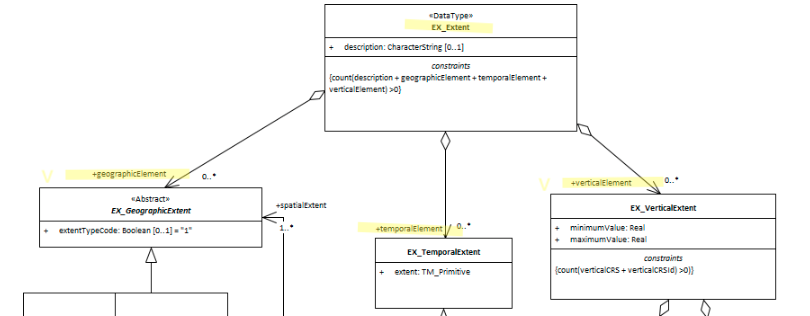

# Resource Extent ★★★★
* To quickly determine the general location of features included in a cited spatial resource, it is useful that extent information, geographic, vertical and temporal, are documented in the metadata.*

| | |
| --- | --- |
| **Element Name** | *extent* |
| **Parent** | *[MD_Metadata.identificationInfo>MD_Identification](./class-MD_Identification)* |
| **Class/Type** | *EX_Extent* |
| **Governance** | *Common ICSM, Domain* |
| **Purpose** | *Discovery* |
| **Audience** | machine resource - ⭑ ⭑ ⭑ ⭑ |
| | general - ⭑ ⭑ ⭑ ⭑ |
| | resource manager - ⭑ ⭑ |
| | specialist - ⭑ ⭑ ⭑ (higher if domain specific placenames are used) |
| **Metadata type** | *descriptive* |
| **ICSM Level of Agreement** | ⭑ ⭑ ⭑ |

## Definition
**The spatial and temporal extent of the resource.**

### ISO Obligation
- There can be zero to many [0..\*] *extent* packages for the cited resource in the *[MD_Metadata](./class-MD_Metadata)* package in a metadata record. These may be of the type *Geographic* ([EX_GeographicExtent](./GeographicExtent)), *Vertical* ([EX_VerticalExtent](./VerticalExtent)), or *Temporal* ([EX_TemporalExtent](./TemporalExtents)).

## Discussion
Every metadata record describing resources should describe the extent of the area of interest of that resource. This extents descriptions may be surface geographic, vertical and / or temporal and may contain exclusions. Those searching for resources can be provided with a quick idea of the extent of the resource. Software can use these extents to analyses and narrow searches to particular areas of interest. 

The use of multiple instances is useful for describing more complicated resources.

## ICSM Recommendations

Therefore - It is strongly recommended that to support discovery of resources, every metadata record contains, as needed, surface geometric, vertical and temporal extent description of the resource area of interest. Use multiple instances if it helps describe the resource for the user.

Metadata for spatial resources should at a minimum contain bounding box description of the resource. Other dimensions, such as time, should be described when useful. 

### Recommended Sub-Classes
* **[geographicElement](./GeographicExtent) -** *(class - EX_GeographicExtent)*
* **[verticalElement](./VerticalExtent) -** *(class - EX_VerticalExtent)*
* **[temporalElement](./TemporalExtents) -** *(class - EX_TemporalExtent)*

## Also Consider 
- **[GeoExtent](./GeographicExtent)** *(abstract class - EX_GeographicExtent)* has two ICSM recommended types. The third type, bounding polygons if used, should be in addion to:
 - **[Extent Geographic Description](./ExtentGeographicDescription)** *(class - EX_GeographicDescription)* description of the geographic area using identifiers
 - **[Extent Bounding Box](./ExtentBoundingBox)** *(class - EX_GeographicExtent)* approximate geographic position of the resource using EPSG 4326 coordinate pairs with a precision of up to two decimal places
- **[Extent Vertical](./VerticalExtent)** *(class - EX_GeographicExtent)* vertical domain of resource in specified units
- **[Extent Temporal](./TemporalExtents)** *(class - EX_GeographicExtent)* time period covered by the content of the resource

## Outstanding Issues
> **EX_Extent.description**  
The *"description"* element of EX_Extent offers a freeform way of describing the extent of a resource. We have not had any discussion as to the use of this element. GeoNetwork uses it to provide a code list delimited set of values by which the EX_GeographicBoundingBox elements are populated. It would seem more correct to use EX_GeographicDescription and it MD_Identifier element to this purpose.

## Crosswalk considerations

### Dublin core / CKAN / data.gov.au 
Mapping to CKAN and Dublin core elements, particularly as used by data.gov.au needs discussion

## Examples

### UML diagrams
Recommended elements highlighted in Yellow

\pagebreak

