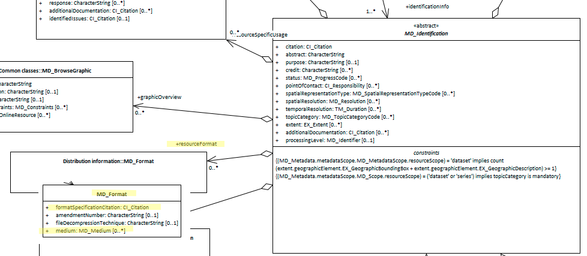

# Resource Format ★★★
*Information about how a cited spatial resource is kept on the host system can be useful to individuals such as subject matter specialist and data managers. General audiences will be more interested in the [distribution format](./DistributionInfo)*.

| | |
| --- | --- |
| **Element Name** | *resourceFormat* |
| **Parent** | *[MD_Metadata.identificationInfo>MD_Identification](./class-MD_Identification)* |
| **Class/Type** | *MD_Format* |
| **Governance** | *Agency* |
| **Purpose** | *Discovery, Usage* |
| **Audience** | machine resource - ⭑ ⭑ ⭑ ⭑ |
| | general - ⭑ ⭑ |
| | resource manager - ⭑ ⭑ ⭑ ⭑|
| | specialist - ⭑ ⭑ ⭑ ⭑ |
| **Metadata type** | *administrative* |
| **ICSM Level of Agreement** | ⭑ ⭑ ⭑ |

## Definition
**Description of the computer language construct that specifies the representation of the data objects in a record, file, message, storage device, or transmission channel**

### ISO Obligation

There may be zero or many [0..\*] *resourceFormats* for the cited resource in the *[MD_DataIdentification](./class-MD_DataIdentification)* package of class *MD_Format* desrcibed in a metadata record.

## Discussion

Knowledge of the native format of a resource provides a user that has direct access to such a great deal of insight as to how the resource might fit their need. It also provides a specialist user insight as to the technical limitations and capabilities of the resource. it is of high value to data managers as it provides invaluable information about the storage and use of these resources which the manager can use to know how to provide future support.
Most external users would likely be more interested in the distribution format.

### Outstanding Issues

> **CORE ISSUE:**
This element seems to be about the native format in which the data is kept by an organisation. This may or may not be the same as the distribution format. It is the distribution format that most people would want to know from a metadata record (except internal users).

> **Applied to SV_ServiceIdentification**
This element makes more sense when applied to service metadata. In that case, the resource format is what is of interest as the service is the distribution channel.

## ICSM Best Practice Recommendations

Therefore - it is recommended that format information about a resource be captured in the metadata. The details to include are to be at the best judgement of the managers and direct users of the resource.

It is not recommended, except in the case of service information metadata, that this element be used to hold distribution format information. That is better conveyed in a *distributionFormat* element under [MD_Distribution](./DistributionInfo).

This element should be populated in all metadata records with information about the format in which the resource is stored and managed within the agency, This is not about the format in which the resource is distributed which often differs.

### Recommended Sub-Elements

From class - *[MD_Format](http://wiki.esipfed.org/index.php/MD_Format)*

* **formatSpecificationCitation -** *(class - [CI_Citation](./class-CI_Citation))* citation/URL of the specification for the format
* **medium -** *(class - [MD_Medium](http://wiki.esipfed.org/index.php/MD_Medium))* medium used by the format

### Crosswalk considerations

<details>

#### Dublin core / CKAN / data.gov.au 

likely unneeded unless a service

#### DCAT 

mapping as yet unknown

</details>

## Also Consider

- **[MD_Distribution.distributionFormat -](./DistributionInfo)** holds information about the format in which the data is distributed.


## Examples

<details>

### XML 
```
<mdb:MD_Metadata>
....
  <mdb:identificationInfo>
   <mri:MD_DataIdentification>
   ....
     <mri:resourceFormat>
      <mrd:MD_Format>
        <mrd:formatSpecificationCitation>
         <cit:CI_Citation>
           <cit:title>
            <gco:CharacterString>PostGIS</gco:CharacterString>
           </cit:title>
         </cit:CI_Citation>
        </mrd:formatSpecificationCitation>
        <mrd:medium>
         <mrd:MD_Medium>
           <mrd:name>
            <cit:CI_Citation>
              <cit:title>
               <gco:CharacterString>My Cloud
               </gco:CharacterString>
              </cit:title>
            </cit:CI_Citation>
           </mrd:name>
         </mrd:MD_Medium>
        </mrd:medium>
      </mrd:MD_Format>
     </mri:resourceFormat>
   ....
   </mri:supplementalInformation>
 </mri:MD_DataIdentification>
....
</mdb:MD_Metadata>
```

\pagebreak

### UML diagrams
Recommended elements highlighted in yellow



</details>

\pagebreak
