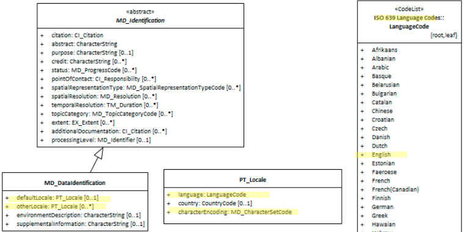

#  Resource Default Locale ★★★★
*Most spatial resources contain some textual information written in particular languages. For users it is important that the language of the resource be shared. Default Locale provide a way to record the primary language of the metadata.*

| | |
| --- | --- |
| **Element Name** | *defaultLocale* |
| **Parent** | *[MD_Metadata.identificationInfo>MD_Identification](./class-MD_Identification)* |
| **Class/Type** | *PT_Locale* |
| **Governance** | *Common ICSM* |
| **Purpose** | *Discovery, Data Management* |
| **Audience** | machine resource - ⭑ ⭑ |
| | general - ⭑ ⭑ ⭑ ⭑ ⭑|
| | resource manager - ⭑ ⭑ ⭑ ⭑|
| | specialist - ⭑ ⭑ ⭑ ⭑ |
| **Metadata type** | *descriptive* |
| **ICSM Level of Agreement** | ⭑ ⭑ ⭑ |

## Definition
**Designation of the language used within the cited resource.**

### ISO Obligation
- There may be only one [0..1] *defaultLocale* entries for the resource in the metadata  *[MD_DataIdentification](./class-MD_DataIdentification)* package. This must be of class *[PT_Locale](./PT_Locale)*.
-
## Discussion

There may be only one default locale for a resource identified in a metadata record.
The element "otherLocale" can be use to provide information about alternatively used localised character strings

## ICSM Best Practice Recommendations

Therefore - in order to meet ICSM good practice, in metadata for data resources, one default language of the resource should be captured if the resource contains language elements, and its character set encoding in `MD_DataInformation.defaultLocale`. For the users in our region, English should be the default value for `language` using the ISO 639-2, 3-alphabetic digits code "eng" and the character encoding should be *UTF8*. If the resource contains multiple languages, capture the dominant one in `defaultLocale` and populate the sibling element `otherLocale` with  information describing these additional languages in the same manner.

### Recommended Sub-Elements

- Follow the general guidance for *[class - PT_Locale](./PT_Locale)*

### Recommended Sibling Elements

- **otherLocale -** *[class - PT_Locale]* [0..\*] when a resource has information in additional languages
 - Follow the general guidance for [class - PT_Locale](./PT_Locale)


### Crosswalk considerations

<details>

#### ISO19139

MD_DataIdentification/language and MD_DataIdentification/characterSet moved to MD_DataIdentification/defaultLocale:PT_Locale - Make use of the newly added Language and character set localization package for defining local language and character set.

#### Dublin core / CKAN / data.gov.au

Maps to `language`

CKAN has one field for language that maps to both Metadata and Resource language fields. ISO 19115 recommends 639-2 3 letter codes. Data.gov.au recommends IETF RFC4646 2 letter codes as primary. See https://www.loc.gov/standards/iso639-2/faq.html#6 for discussion of the differences

#### DCAT

Maps to `dct.language`.  

> Note BC 19-7: It iis unclear if DCAT makes a distinction between the metadata language and the resource language

#### RIF-CS

No identified mapping

</details>

## Also Consider

- **MD_DataIdentification.otherLocale -**  *(codelist - PT_Locale)* [0..\*] alternate localised language(s) and character set (s) used within the resource
- **[Metadata Default Locale](./MetadataLocale)** *(codelist - PT_Locale)* [0..1]  contains the  language and character set used in the metadata
- **MD_Metadata.otherLocale -** *(codelist - PT_Locale)* [0..\*] provides information about alternatively used localised character strings provides information about alternatively used localised character strings

## Examples

<details>

### XML -

```
<mdb:MD_Metadata>
....
   <mdb:identificationInfo>
      <mri:MD_DataIdentification>
      ....
          <mri:defaultLocale>
            <lan:PT_Locale>
               <lan:language>
                  <lan:LanguageCode 
                  codeList="http://www.loc.gov/standards/iso639-2/" 
                  codeListValue="eng"/>
               </lan:language>
               <lan:characterEncoding>
                  <lan:MD_CharacterSetCode 
                  codeList="https://schemas.isotc211.org/19115/resources
                  /Codelist/cat/codelists.xml#MD_CharacterSetCode" 
                  codeListValue="utf8"/>
               </lan:characterEncoding>
            </lan:PT_Locale>
         </mri:defaultLocale>
         ....
      </mri:MD_DataIdentification>
   </mdb:identificationInfo>
....
</mdb:MD_Metadata>

```

\pagebreak

### UML diagrams
Recommended elements highlighted in yellow



</details>

\pagebreak
