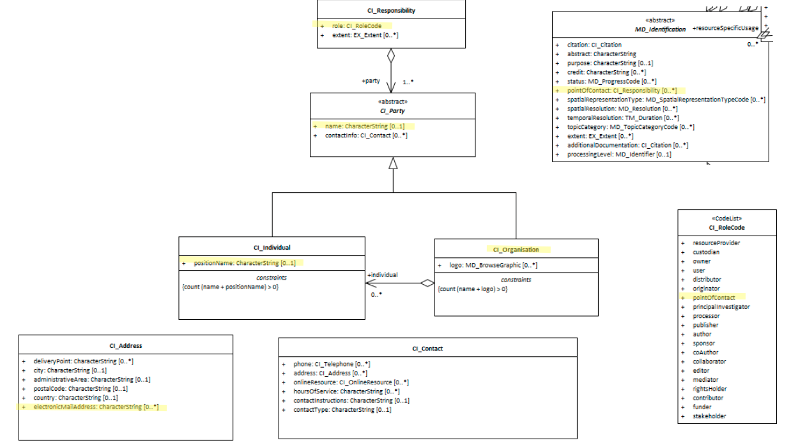

# Resource Point of Contact ★★★★★
*One of the most important pieces of information that can be shared in a metadata record is the resource Point of Contact. By retrieving the means to access the party responsible for questions about the resource, all other information should be able to be obtained even if it is not in the metadata.*

| | |
| --- | --- |
| **Element Name** | *pointOfContact* |
| **Parent** | *[MD_Metadata.identificationInfo>MD_Identification](./class-MD_Identification)* |
| **Class/Type** | *[CI_Responsibility](./class-CI_Responsibility)* |
| **Governance** | *Agency* |
| **Purpose** | *Discovery, Evaluation, Communications* |
| **Audience** | machine resource - ⭑ ⭑ |
| | general - ⭑ ⭑ ⭑ ⭑ ⭑ |
| | resource manager - ⭑ ⭑ ⭑ ⭑ ⭑ |
| | specialist - ⭑ ⭑ ⭑ |
| **Metadata type** | *descriptive* |
| **ICSM Level of Agreement** | ⭑ ⭑ ⭑ ⭑ |

## Definition
**The name and contact information for the organisation, role and/or individual that serves as the point of contact for the cited resource.**

### ISO Obligation

- There may be one or more [0..\*] *pointOfContact* packages for the cited resource in the *[MD_DataIdentification](./class-MD_DataIdentification)* package for those responsible for the resource. These will be of class *[CI_Responsibility](./class-CI_Responsibility)*.

## Discussion

This element exists for the provision of a set of attributes for identification of, and means of communication with, person(s) and organisation(s) associated with the resource be they data or service (*[MD_DataIdentification](./class-MD_DataIdentification)* or *[SV_ServiceIdentification](./ServiceIdentification)*). This element refers to the party responsible for the resource itself and the maintenance of this resource. It does not refer to the party responsible for the metadata or the distribution of the resource.

This is a compound element of type CI_ResponsibleParty. At least one should be present. Recommended role value - "PointOfContact" with attached email. Other contacts can be added as required. Other role values are acceptable.

## ICSM Best Practice Recommendations

Therefore - to meet ICSM good practice, in all metadata records, at least one point of contact should be given for the party responsible for the cited resource. These should default to role code "Point of Contact". In addition, for minimal conformity, `name` (of organisation preferred), `positionName` and `electronicMailAddress` should also be populated.
The use of the new `partyIdentifier` element added in the 2018 amendment to the standard is encouraged by all parties.


### Recommended Sub-Elements

Follow the general guidelines for [CI_Responsibility](./class-CI_Responsibility).

- One value of `role` should be "Point of Contact", but may be another depending on agency guidance, e.g. if a custodian is also the primary point of contact, *custodian* may be the most appropriate choice for `role`.
- **partyIdentifier -** *(class - [MD_Identifier](./class-MD_Identifier))* [0..\*]  identifier for the party, usually a URI such as an ORCID. Use of this package is recommended when this option exists.
> Note BC 30-7: Do we have some regional alternatives to ORCID to recommend?

## Also Consider

- **[Metadata Responsible Party](./MetadataContact)** Contact information for the recommended party to contact about the metadata.
- **[Resource Cited Reponsible Party](./ResourceResponsibleParty)** contact information for the parties otherwise responsible for aspects of the the resource creation and maintenance.
- **[DistributionInfo](./DistributionInfo)** Includes Distributor contact information.

## Crosswalk considerations

<details>

### ISO19139

See discussion at [CI_Responsibility](./class-CI_Responsibility)

### Dublin core / CKAN / data.gov.au

Maps to `contact` 
> Note BC 19-7: These map to the same elements as Metadata Contact. Is this a problem?

### DCAT

Maps to `dcat:contactPoint`

### RIF-CS

Maps to `Related Party`

</details>

## Examples

<details>

### XML
```
<mdb:MD_Metadata>
....
  <mdb:identificationInfo>
   <mri:MD_DataIdentification>
....
    <mri:pointOfContact>
      <cit:CI_Responsibility>
        <cit:role>
         <cit:CI_RoleCode 
         codeList="https://schemas.isotc211.org/19115/resources
         /Codelist/cat/codelists.xml#CI_RoleCode" 
         codeListValue="custodian"/>
        </cit:role>
        <cit:party>
         <cit:CI_Organisation>
           <cit:name>
            <gco:CharacterString>OpenWork Ltd</gco:CharacterString>
           </cit:name>
           <cit:contactInfo>
            <cit:CI_Contact>
              <cit:address>
               <cit:CI_Address>
                 <cit:electronicMailAddress>
                  <gco:CharacterString>email@mail.com
                  </gco:CharacterString>
                 </cit:electronicMailAddress>
               </cit:CI_Address>
              </cit:address>
            </cit:CI_Contact>
           </cit:contactInfo>
           <cit:individual>
            <cit:CI_Individual>
              <cit:name>
               <gco:CharacterString>Metadata Bob
               </gco:CharacterString>
              </cit:name>
              <cit:positionName>
               <gco:CharacterString>GIS Guru
               </gco:CharacterString>
              </cit:positionName>
            </cit:CI_Individual>
           </cit:individual>
         </cit:CI_Organisation>
        </cit:party>
      </cit:CI_Responsibility>
     </mri:pointOfContact>
....
   </mri:MD_DataIdentification>
  </mdb:identificationInfo>
....
</mdb:MD_Metadata>
```

\pagebreak

### UML diagrams
Recommended elements highlighted in yellow



</details>

\pagebreak

