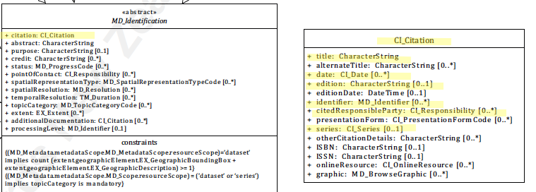

# Resource Responsible Party ★★★★★
*Contact information for the parties responsible for various aspects of a resource is useful to users and managers of the resource and improves the ability of these parties to communicate. Some of the most basic users needs of a cited resource are to know who to contact for more information for information about different aspects of the resource. In ISO 19115-1 we capture this information in MD_identification.citation.*

| | |
| --- | --- |
| **Element Name** | *citedResponsibleParties* |
| **Parent** | *[MD_Metadata.identificationInfo>MD_Identificationcitation>CI_Citation](./ResourceCitation)* |
| **Class/Type** | *CI_Responsibility* |
| **Governance** | *Common ICSM, Agency, Domain* |
| **Purpose** | *Discovery, Identification, Communication* |
| **Audience** | machine resource - ⭑ ⭑ |
| | general - ⭑ ⭑ ⭑ ⭑ ⭑ |
| | resource manager - ⭑ ⭑ ⭑ ⭑ |
| | specialist - ⭑ ⭑ ⭑ |
| **Metadata type** | *descriptive, administrative* |
| **ICSM Level of Agreement** | ⭑⭑⭑⭑ |

## Definition
**Name, role, and instructions for contacting the organisation, role and/or individual responsible for the cited resource.**

### ISO Obligation

- There may be zero or more [0..\*] *citedResponsibleParties* provided for the cited resource in the *[MD_Identification.citation](./ResourceCitation)* package. These will be of class [CI_Responsibility](./class-CI_Responsibility). The resource may be of type Data *[MD_DataIdentification](./class-MD_DataIdentification)* or of type Service *[SV_ServiceIdentification]

## Discussion

This element captures contact information for those parties responsible for various aspects of the cited resource. It does not refer to the party responsible for the metadata record itself. General contact information for the resource should be captured in [Resource Point of Contact](./ResourcePointOfContact).

There may be multiple responsible parties who hold different responsibilities. The responsibility of each party is captured in the element CI_Responsibility > role. Entries for "author" and "publisher" are recommended. 

## ICSM Best Practice Recommendations

Therefore - to meet ICSM best practice, in all metadata records, contact information should be given for the parties responsible for different aspects of the creation, management and maintenance of the resource. Entries for "author" and "publisher" should be provided. In addition, for minimal conformity, `name` (of organisation preferred), `positionName` and `electronicMailAddress` should also be populated.
The use of the new `partyIdentifier` element added in the 2018 amendment to the standard is encouraged by all parties.

 This element should be populated in all metadata records with a minimum of `role`, `name` (of organisation preferred), `positionName` and `electronicMailAddress`.

### Recommended Sub-Elements

Follow the general guidelines for [CI_Responsibility](./class-CI_Responsibility).

- Recommended `role` values should include (but not be limited to) include "Point of Contact" as well as an entry for "publisher". "author" or "publisher".

## Also Consider

- **[Resource Point of Contact](./ResourcePointOfContact)** - contact information for the recommended party to contact about the resource
- **[Metadata Responsible Party](./MetadataContact)** - contact information for the recommended party to contact about the metadata
- **[DistributionInfo](./DistributionInfo)** - includes distributor contact information
- **[Citation](./ResourceCitation)** - the parent package of which resouce responsible party is a part
- **[Resource Citation](./ResourceCitation)** - parent to this element

## Crosswalk considerations

<details>

### ISO19139

See discussion at [CI_Responsibility](./class-CI_Responsibility)

### Dublin core / CKAN / data.gov.au

Maps to `publisher`

### DCAT

Maps to `dct:publisher`

### RIF-CS

Maps to `Publisher`

</details>


## Examples

<details>

### XML

```
<mdb:MD_Metadata>
....
 <mdb:identificationInfo>
  <mri:MD_DataIdentification>
  ....
    <mri:citation>
     <cit:CI_Citation>
       <cit:title>
        <gco:CharacterString>OpenWork geographical data
        </gco:CharacterString>
       </cit:title>
       <cit:date>
        <cit:CI_Date>
          <cit:date>
           <gco:Date>2019-07-18</gco:Date>
          </cit:date>
          <cit:dateType>
           <cit:CI_DateTypeCode 
           codeList="https://schemas.isotc211.org/19115/resources
           /Codelist/cat/codelists.xml#CI_DateTypeCode" 
           codeListValue="creation"/>
          </cit:dateType>
        </cit:CI_Date>
       </cit:date>
       <cit:date>
        <cit:CI_Date>
          <cit:date>
           <gco:Date>2019-07-18</gco:Date>
          </cit:date>
          <cit:dateType>
           <cit:CI_DateTypeCode 
           codeList="https://schemas.isotc211.org/19115/resources
           /Codelist/cat/codelists.xml#CI_DateTypeCode" 
           codeListValue="publication"/>
          </cit:dateType>
        </cit:CI_Date>
       </cit:date>
       <cit:edition>
        <gco:CharacterString>Version 0.1</gco:CharacterString>
       </cit:edition>
       <cit:editionDate>
        <gco:Date>2019-07-18</gco:Date>
       </cit:editionDate>
       <cit:identifier>
        <mcc:MD_Identifier>
          <mcc:code>
          <gco:CharacterString>9547e07e-6a15-403b-8b19-488778fe0cf0
          </gco:CharacterString>
          </mcc:code>
          <mcc:codeSpace>
           <gco:CharacterString>
           http://202.49.243.69:8080/geonetwork/srv/eng/metadata/
           </gco:CharacterString>
          </mcc:codeSpace>
        </mcc:MD_Identifier>
       </cit:identifier>
       <cit:citedResponsibleParty>
        <cit:CI_Responsibility>
          <cit:role>
           <cit:CI_RoleCode 
           codeList="https://schemas.isotc211.org/19115/resources
           /Codelist/cat/codelists.xml#CI_RoleCode" 
           codeListValue="author"/>
          </cit:role>
          <cit:party>
           <cit:CI_Organisation>
             <cit:name>
              <gco:CharacterString>OpenWork Ltd
              </gco:CharacterString>
             </cit:name>
             <cit:contactInfo>
              <cit:CI_Contact>
                <cit:address>
                 <cit:CI_Address>
                   <cit:electronicMailAddress>
                    <gco:CharacterString>info@openwork.nz
                    </gco:CharacterString>
                   </cit:electronicMailAddress>
                 </cit:CI_Address>
                </cit:address>
              </cit:CI_Contact>
             </cit:contactInfo>
           </cit:CI_Organisation>
          </cit:party>
        </cit:CI_Responsibility>
       </cit:citedResponsibleParty>
       <cit:citedResponsibleParty>
        <cit:CI_Responsibility>
          <cit:role>
           <cit:CI_RoleCode 
           codeList="https://schemas.isotc211.org/19115/resources
           /Codelist/cat/codelists.xml#CI_RoleCode" 
           codeListValue="publisher"/>
          </cit:role>
          <ci
          t:party>
           <cit:CI_Individual>
             <cit:name>
              <gco:CharacterString>Byron Cochrane
              </gco:CharacterString>
             </cit:name>
             <cit:contactInfo>
              <cit:CI_Contact>
                <cit:address>
                 <cit:CI_Address>
                   <cit:electronicMailAddress>
                    <gco:CharacterString>byron@openwork.nz
                    </gco:CharacterString>
                   </cit:electronicMailAddress>
                 </cit:CI_Address>
                </cit:address>
              </cit:CI_Contact>
             </cit:contactInfo>
           </cit:CI_Individual>
          </cit:party>
        </cit:CI_Responsibility>
       </cit:citedResponsibleParty>
     </cit:CI_Citation>
    </mri:citation>
   ....
  </mri:MD_DataIdentification>
 </mdb:identificationInfo>
....
</mdb:MD_Metadata>
```

\pagebreak

### UML diagrams
Recommended elements highlighted in yellow



</details>

\pagebreak
