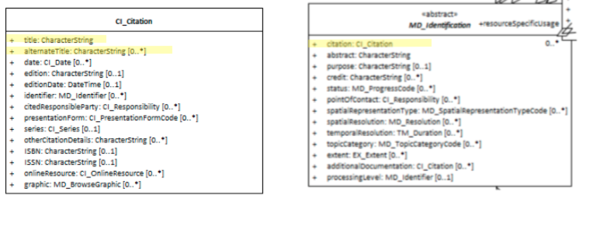

# Resource Title ★★★★★
*The most important component of the [Resource Citation](./class-CI_Citation) is the **title** element. To easily communicate about a resource and at least locally differentiate it from others, it is useful that the resource has a common name. This name is captured in the [Resource Citation](./ResourceCitation) **title** element.*

| | |
| --- | --- |
| **Element Name** | *title* |
| **Parent** | *[MD_Metadata.identificationInfo>MD_Identificationcitation>CI_Citation](./ResourceCitation)* |
| **Class/Type** | *characterString* |
| **Governance** | *Common ICSM, Agency, Domain* |
| **Purpose** | *Discovery, Identification* |
| **Audience** | machine resource - ⭑ |
| | general - ⭑ ⭑ ⭑ ⭑ ⭑ |
| | resource manager - ⭑ ⭑ ⭑ |
| | specialist - ⭑ ⭑ ⭑ |
| **Metadata type** | *descriptive* |
| **ICSM Level of Agreement** | ⭑⭑⭑⭑ |

## Definition
**The most common useful name by which the resource is known.**

### ISO Obligation

- There must be one and only one [1..1] *title* element for the cited resource in the *[MD_Identification.citation](./ResourceCitation)* package in a metadata record of type *character string*. The resource may be of type Data *[MD_DataIdentification](./class-MD_DataIdentification)* or of type Service *[SV_ServiceIdentification].

## Discussion

The value of the title field should be the most common name by which the resource is known by your largest perceived audience. It should be relatively unique or made so by the inclusion of expanded title elements such as edition numbers or agency name.

There can be multiple alternate titles captured for a resource in the sibling element `alternateTitle`. These should be populated with other known names or variations of the name.

## ICSM Recommendations

Therefore - there must be one title given for a resource. The value of the title field should be the most common name by which the resource is known by your largest perceived audience. It should be relatively unique or made so by the inclusion of expanded title elements such as edition numbers or agency name.

Use the sibling element `alternateTitle` to capture other names by which the resource may be known. Index both `title` and `alternateTitle` in the same index to increase the likelihood that the resource may be found by the title that others may know it.

If the title is not a common language name, at least one alternate title should be common language title such as a layperson may identify it.

### ICSM Good Practice

- All metadata records must have the element *MD_Metadata.indentificationInfo>MD_Identification.citation>CI_Citation.title* populated with the most common useful name by which the resource is known.

## Also Consider

- **alternateTitle -** *(type - charStr)* [0..\*] Sibling to `title`. A short name or another language name by which the cited information is known. Example: DCW as an alternative title for Digital Chart of the World. Recommended whenever there are alternate names commonly in use.
- **[ResourceCitation](./ResourceCitation)** - parent to this element

## Crosswalk considerations

<details>

### Dublin core / CKAN / data.gov.au

Maps to `title`

### DCAT

Maps to `dct.title`

### RIF-CS

Maps to `Title`

</details>

## Examples

<details>

### Example Current Use

#### ABARES
"2.5M Topographical Series 1998 MAPDATA TOPO_2.5M Scale 1:2.5 Million"

#### GA
“Geomorphic features of the Antarctic and Southern Ocean 2012"

#### Data.govt.au
Location of Medicare Offices

### XML
```
<mdb:MD_Metadata>
....
  <mdb:identificationInfo>
   <mri:MD_DataIdentification>
     <mri:citation>
      <cit:CI_Citation>
        <cit:title>
         <gco:CharacterString>OpenWork geographical data<
         /gco:CharacterString>
        </cit:title>
        <cit:alternateTitle>
         <gco:CharacterString>geodata by OpenWork</gco:CharacterString>
        </cit:alternateTitle>
        ....
      </cit:CI_Citation>
     </mri:citation>
     ....
   </mri:MD_DataIdentification>
  </mdb:identificationInfo>
....
</mdb:MD_Metadata>
```

\pagebreak

### UML diagrams
Recommended elements highlighted in yellow



</details>

\pagebreak
