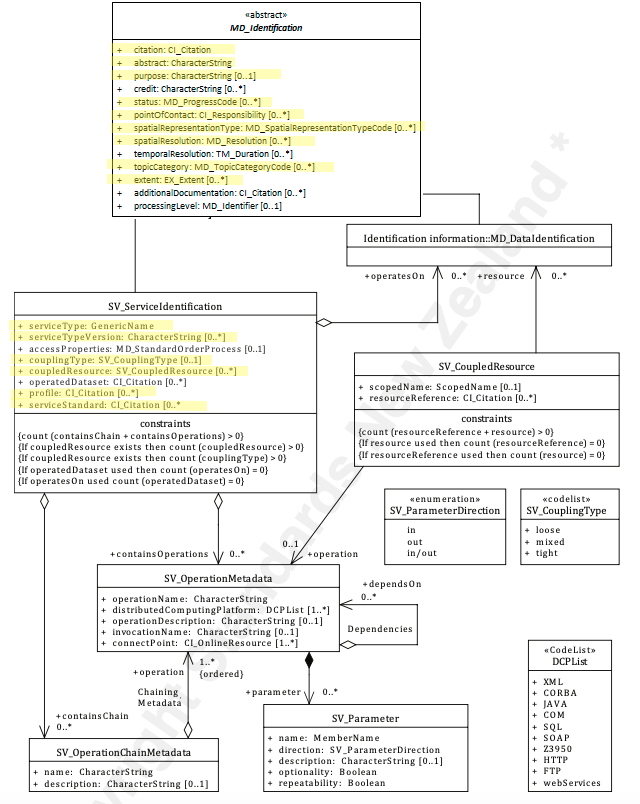

# Service Identification
*When capturing information on a spatial service, it is important to identify and categorise information as pertaining to the service resource and to distinguish this information from that which applies to the metadata itself or data resources. SV_ServiceIdentification extends the abstract class MD_Identification to document a spatial service resource.*

| | |
| --- | --- |
| **Element Name** | *SV_ServiceIdentification* |
| **Parent** | *[MD_Metadata.identificationInfo](./class-MD_Identification)* |
| **Class/Type** | *MD_Identification* |
| **Governance** | *ISO* |
| **Purpose** | *Discovery, Evaluation, Use* |
| **Audience** | machine resource - ⭑ ⭑ ⭑ |
| | general - ⭑ ⭑ ⭑|
| | resource manager - ⭑ ⭑ ⭑ |
| | specialist - ⭑ ⭑ ⭑ |
| **Metadata type** | *descriptive* |
| **ICSM Level of Agreement** | ⭑⭑ |

## Definition -

**Identification of capabilities which a service provider makes available to a service user through a set of interfaces that define a behaviour.**

### ISO Requirements
At least one [1..\*] [MD_Identification](http://wiki.esipfed.org/index.php/MD_Identification) must be present in a metadata record. This must be instantiated as an `SV_ServiceIdentification` for metadata about service resources.

### ISO Associations 

**[MD_Identification](http://wiki.esipfed.org/index.php/MD_Identification)** is an abstract class that is parent to 

- **SV_ServiceIdentification** and
- **[MD_DataIdentification](./DataIdentification)**

Is a child of:
- **MD_Metadata.identificationInfo**

## Discussion

The class, SV_ServiceIdentification, contains all metadata related to the identification of a service resource. The provision of this information strongly impacts on the ability of a user to assess the resource fitness to use. Like [MD_DataIdentification](./DataIdentification), SV_ServiceIdentification instantiates the abstract class [MD_Identification](./class-MD_Identification) for use with service resources. As such it inherits all the properties of that class.

The relation of a geospatial service to the data on which it operates is varied. This relation impacts the decisions one may make regarding the capture of useful metadata for such a service. These services fall into three categories depending on how tightly coupled the data is to the service. 

An example of a *tightly coupled* service would be a WFS service delivering a particular dataset. In the tightly coupled case, the service metadata shall describe both the service and the geographic dataset. The permitted values for the description of operations shall be constrained by the values defined by the datasets associated with the service.

An example of a *loosely coupled* service could be a reprojection service with user-selected input datasets. Loosely coupled services may have an association with data types through the service type definition (SV_ServiceIdentification.serviceType). Dataset metadata need not be provided in the service metadata for the loosely coupled case.

A *mixed coupling* might be a WMS service into which add additional data sources of your choice. In a mixed coupling situation, a single service instance may be associated with both kinds of data associated, loosely and tightly coupled. 

## ICSM Best Practice Recommendations

Therefore - to clearly understand what resource a metadata record is describing, there should be one and only one [1..1] *MD_Identification* package in a metadata record. For service metadata, this must be expressed as an *SV_ServiceIdentification* instance. The *Service Indentifaction* package contains several sub-packages and sub-elements. To ease the common use of such metadata, it is important that the use of these sub-packages and sub-elements be standardised.

### Recommended Service Sub-Elements 
In addition the recommended attributes of [MD_Identification](./class-MD_Identification) detailed below, the following *SV_ServiceIdentification* subpackages and sub-elements are recommended.

> **Note -Service Types and Standards descriptors** - There are multiple methods of describing the type of service being provided. Of these *ServiceType* is mandatory. Also, there should be at least one entry in *Keywords* of type *Service* that also describes the service. The following others are recommended when appropriate.

- **[Service Type -](./ServiceType)** *(class - GenericName)* [1..1] Mandatory. A Service metadata record must provide a name for the service type, e.g. ‘discovery’, ‘view’, ‘download’, ‘transformation’, or ‘invoke'. Note - A GenericName (see ISO 19103:2015) shall indicate the meaning of the named value. Its value should be taken from a well-governed source if possible.
- **[Service Type Version -](./ServiceTypeVersion)** *(type - charStr)* [0..\*]* The version of the service. Provided to enhance searchability based on the version of serviceType. Could be a shorthand handle like WMS 1.4.1.
- **[Service Profile -](./ServiceProfile)** *(class - [CI_Citation](./class-CI_Citation)* [0..\*] When a service conforms to a particular profile of a service standard, the profile to which the service adheres should be cited with details. (May be used instead of service standard)
- **[Service Standard -](./ServiceStandard)** *(class - [CI_Citation](./class-CI_Citation)* [0..\*] When a service conforms to a particular service standard the standard to which the service adheres should be cited with details.
- **[couplingType -](./CouplingType)** *(codeList - SV_CouplingType)* [0..1]Highly Recommended. Describes the type of coupling between service and associated data (if exists). Available values for *SV_CouplingType* are:
  - *loose* - service instance is loosely coupled with a data instance, i.e. no MD_DataIdentification class has to be described.
  - *mixed* - service instance is mixed coupled with a data instance, i.e. MD_DataIdentification describes the associated data instance and additionally the service instance might work with other external data instance.
  - *tight* - service instance is tightly coupled with a data instance, i.e. MD_DataIdentification class MUST be described.
 - **[coupledResource](./CoupledResource) -** *(class - SV_CoupledResource)* [0..\*] Highly Recommended in the case of tightly coupled services. Provides access to the description of the coupled data resources and enables the description of the link between an operation, and the data on which it is based. It is recommended that this provides URLs that resolve to metadata for the data resources.
- **[Contains Operations -](./ContainsOperations)** *(class - SV_OperationsMetadata* [0..\*]

### Other Recommended Sub-Elements 

The following provides additional guidance to [MD_Identification](./class-MD_Identification) inherited element recommendations.

- **[Resource Citation -](./ResourceCitation)** *(class - [CI_Citation](./class-CI_Citation)* [1..1] - Mandatory. Citation information providing the name, publication date, identifiers, originators and publishers of the service.
- **[abstract -](./Abstract)** *(type - charStr)* [1..1] - Mandatory. A brief narrative summary of the cited service resource and its functions.
- **[purpose -](./Purpose)** *(type - charStr))* [0..1] - Recommended. A brief summary of the intentions and intended users with which the service resource was developed.
- **[status -](./Status)** *(codelist - [MD_ProgressCode](http://wiki.esipfed.org/index.php/ISO_19115_and_19115-2_CodeList_Dictionaries#MD_ProgressCode))* [0..1] - Recommended. The status of the service resource populated from a domain of values.
- **[topicCategory -](./TopicCategory)** *(enumeration - [MD_TopicCategoryCode](http://wiki.esipfed.org/index.php/ISO_19115_and_19115-2_CodeList_Dictionaries#MD_TopicCategoryCode))* [0..\*] - Recommended. The main themes of the service resource populated from a fixed domain of values.
- **[pointOfContact -](./ResourcePointOfContact)** *(class - [CI_Responsibility](./class-CI_Responsibility))* [0..1] - Highly Recommended. The name and contact information for the organisation, role and/or individual that provides a point of contact for the cited service.
- **[spatialRepresentationType -](./SpatialRepresentationType)** *(codelist - MD_SpatialRepresentationTypeCode)* [0..\*] - Optional. The method used by the service to spatially represent geographic information.
- **[spatialResolution -](./SpatialResolution)** *(class - MD_Resolution)* [0..\*] - Recommended. The nominal scale and/or spatial resolution at which the service is designed to be used.
- **[graphicOverview -](./BrowseGraphic)** *(class - MD_BrowseGraphic)* [0..\*] - Optional. Graphics that provide lightweight illustrations pertaining to a service.
- **[additionalDocumentation -](./AdditionalDocs) -** *(class - [CI_Citation](./class-CI_Citation))* [0..\*] - Recommended. Citation of other documentation associated with the service, e.g. related articles, publications, user guides, data dictionaries.
- **[associatedResource -](./AssociatedResources) -** *(class - [MD AssociatedResource](http://wiki.esipfed.org/index.php/MD_AssociatedResource))* [0..\*] - Highly recommended when part of a larger work. Used to indicate association between resources and records related to the service of which the sevice is a part.
- **[Extents -](./ResourceExtent)** *(class - [EX_Extent](http://wiki.esipfed.org/index.php/EX_Extent))* [0..\*] Recommended when the Service has extent limitations. High-level thematic classifications to assist in the grouping and searching of data. 
- **[referenceSystemInfo -](./SpatialReferenceSystem)** *(class - MD_ReferenceSystem)* [0..\*] Highly Recommended. The information about the reference systems that define the system use to describe spatial position descriptions in a service.
- **resourceConstraints -** *( abstract class [MD_Constraints](./class-MD_Constraints))* [0..\*] Highly Recommended. See:
 - **[Resource Security Constraints](./ResourceSecurityConstraints)**
 - **[Resource Legal Constraints](./ResourceLegalConstraints)**
 - **[Resource Other Constraints](./ResourceOtherConstraints)**

#### Additional optional attributes
- **Access Properties** *(class - MD_StandardOrderProcess)* [0..\*]* information about the availability of the service, including,
  - fees
  - planned available date and time
  - ordering instructions
  - turnaround
- **operatedDataset** *(class - [CI_Citation](./class-CI_Citation)* [0..\*] NOT Recommended. Provides a reference to the resource on which the service operates. Should refernence existing metadata for the data resource. NOTE - For one resource either `operatedDataset` or `operatesOn` may be used (not both for the same resource)
- **operatesOn -** *(class - MD_DataIdentification)* [0..\*] NOT Recommended. Alternative to `opereratedDataset`. Contains full Data Identification metadata for the resource and thus not recommended. May be useful in cases where dataset metadata is unavailable. NOTE - For one resource either `operatedDataset` or `operatesOn` may be used (not both for the same resource)

## Related Classes

- **[MD_Identification](./class-MD_Identification)** the abstract parent class to `SV_ServiceIdentification` and `MD_DataIdentification`. See guidances for the composite elements.
- **[MD_DataIdentification](./DataIdentification)** the sibling class to `SV_ServiceIdentification` used to describe data resources

\pagebreak

### UML diagrams

Recommended elements highlighted in yellow

\pagebreak

