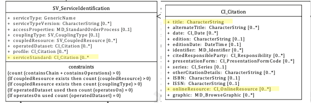

# Service Standard  ★★★ 

*When documenting a spatial service the details of the standard to which a service adheres should be provided so that once descovered potential users may find further authoritative information about such standard.*

|  |  |
| --- | --- |
| **Element Name** | *serviceStandard* |
| **Parent** |  *[MD_Metadata.identificationInfo>SV_ServiceIdentification](./ServiceIdentification)* |
| **Class/Type** | *CI_Citation* |
| **Governance** |  *Common ICSM* |
| **Purpose** | *Evaluation, Use* |
| **Audience** | machine resource - ⭑ ⭑ ⭑ |
|  | general - ⭑ ⭑ ⭑ |
|  | resource manager - ⭑ ⭑ ⭑ ⭑ |
|  | specialist - ⭑ ⭑ ⭑ ⭑ |
| **Metadata type** | *descriptive* |
| **ICSM Level of Agreement** | ⭑ ⭑ |

## Definition  
**The standard to which the service adheres**

### ISO Requirements

There may be zero or more [0-\*] *serviceStandard* entries for the cited resource for a  *[SV_ServiceIdentification](./ServiceIdentification)* package of class *[CI_Citation](./class-CI_Citation)* in a service metadata record.

## Discussion  
To be complete in the description of the standards to which a spatial service adheres, citations, including linkages to official websites and documentation, of such standards should be provided. This will aid potential users in the use of such services or to troubleshoot when the use of such services do not behave as expected.


## ICSM Recommendations 

Therefore - When a service adheres to particular service standards such standards should be cited in this package. If a particular profile of such standard is implemented it is sufficient to document this in *[SV_ServiceIdentification.profile](./ServiceProfile).* If the service may support multiple versions of the service standard, multiple entries of *Service Standard* can document such.

#### Recommended Sub-Elements 
Follow the guidance in *[CI_Citation](./class-CI_Citation)* noting the following element usage:

- **Title -** *(type - charStr)*[1..1] Mandatory -  The well known name of the service standard
- **onlineResource -**  *(class -  [CI_OnlineResource](./class-CI_OnlineResource))* [0..\*] online reference to the cited resource
  - **linkage -** (*type - charStr*) [1..1] Mandatory for *class - CI_OnlineResource* - usually the web address to the authoritative documentation for the service standard

## Also Consider
There are many locations where service type and version information may be captured. Choose appropriately.

**[Service Type](./ServiceType)** The mandatory *serviceType* element should be populated with a value from a managed controled vocabulary containing names for generic types of services. While ISO 19115-1 descibes these values as very specific (e.g. ‘discovery’, ‘view’, ‘download’, ‘transformation’, or ‘invoke') in practice, somewhat generic terms for spatial service standards are often used (e.g. OGC Web Map Service, OGC Web Coverage Service, Atom feed)

**[Service Type Version](./ServiceTypeVersion)** The version of the service.  Provided to enhance searchability based on the version of serviceType. Could be a shorthand handle like WMS 1.4.1

**[Service Profile](./ServiceProfile)**  When a service conforms to a particular profile of a service standard, the profile to which the service adheres should be cited (instead of the Service Standard)

**[Keywords (services)-](./Keywords)**  To enable ease of discovery, a service metadata record should contain at least one keyword of type *service*. The value of such keywords should refer to the service taxonomy defined in ISO 19119.

## Outstanding Issues

> **CORE ISSUE:**  
As there are several methods of capturing the service standard type, profile and version in a service metadata record, it would be useful for the MDWG to come to a strong agreement on which approach is best under what circumstances.


## Crosswalk Considerations 

#### ISO 19139 /19119
None Known

#### Dublin core / CKAN / data.gov.au 
None known

#### DCAT 
{mapping to `DCAT element` and discussion, if any}

#### RIF-CS
{mapping to `RIF-CS element` and discussion, if any}

## Examples

### GA
{example - if any useful}

### ABARES
{example - if any useful}

### Others
{### who - example - if any useful}}

### XML -

```
<mdb:MD_Metadata>
....
<mdb:identificationInfo>
 <srv:SV_ServiceIdentification>
    <mri:citation>
    ....
    </mri:citation>
    <mri:abstract/>
    <srv:serviceStandard>
       <cit:CI_Citation>
          <cit:title>
             <gco:CharacterString>OGC WFS 2.0.0</gco:CharacterString>
          </cit:title>
          <cit:onlineResource>
             <cit:CI_OnlineResource>
                <cit:linkage>
                   <gco:CharacterString>https://www.ogc.org/standards/wfs%20</gco:CharacterString>
                </cit:linkage>
                <cit:protocol gco:nilReason="missing">
                   <gco:CharacterString/>
                </cit:protocol>
                <cit:name gco:nilReason="missing">
                   <gco:CharacterString/>
                </cit:name>
                <cit:description gco:nilReason="missing">
                   <gco:CharacterString/>
                </cit:description>
                <cit:function>
                   <cit:CI_OnLineFunctionCode codeList="http://standards.iso.org/iso/19115/resources/Codelists/cat/codelists.xml#CI_OnLineFunctionCode"
                                              codeListValue=""/>
                </cit:function>
             </cit:CI_OnlineResource>
          </cit:onlineResource>
       </cit:CI_Citation>
    </srv:serviceStandard>
    ....
  </srv:SV_ServiceIdentification>
  ....
</mdb:identificationInfo>
....
</mdb:MD_Metadata>
```

### UML diagrams

Recommended elements highlighted in Yellow



\pagebreak
