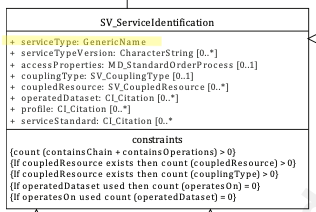

# Service Type ★★★★★ 

*When documenting a service, it is important that the service type be described as a simple generic type so that searches can be so filtered and the use of such service can be categorised.*

| | |
| --- | --- |
| **Element Name** | *serviceType* |
| **Parent** | *[MD_Metadata.identificationInfo>SV_ServiceIdentification](./ServiceIdentification)* |
| **Class/Type** | *genericName* |
| **Governance** | *Common ICSM* |
| **Purpose** | *Discovery, Evaluation, Use* |
| **Audience** | machine resource - ⭑ ⭑ ⭑ |
| | general - ⭑ ⭑ ⭑ |
| | resource manager - ⭑ ⭑ ⭑ |
| | specialist - ⭑ ⭑ ⭑ |
| **Metadata type** | *descriptive* |
| **ICSM Level of Agreement** | ⭑ ⭑ |

## Definition  
*A simple name describing a generic service type, e.g. ‘discovery’, ‘view’, ‘download’, ‘transformation’, or ‘invoke'. Note - A GenericName (see ISO 19103:2015) shall indicate the meaning of the named value. Its value should be taken from a well-governed source if possible.*

### ISO Requirements

There must be one and only one [1..1] *serviceType* entries for the cited resource for a *[SV_ServiceIdentification](./ServiceIdentification)* package of type *genericName* in a metadata record.

## Discussion  
The *serviceType* is useful both as a search filter and for categorisation of the service. It should hold what is considered the primary use of the service in generic terms. The value of this field is of type *genericName* which is described in ISO 19103. While *genericName* values are essentially character strings, the possible values should be selected by a centrally managed controlled vocabulary. Listed values as described in the ISO 19115-1 standard include ‘discovery’, ‘view’, ‘download’, ‘transformation’, or ‘invoke'. However, in practice, more specific terms are often used. In GeoNetwork, the initial suggested values include *OGC Web Map Service, OGC Web Map Tile Service, OGC Web Feature Service, OGC Web Coverage Service, OGC Web Processing Service*, and *Atom feed*. 


## ICSM Best Practice Recommendations 

Therefore - The mandatory *serviceType* element should be populated with a value from a managed controlled vocabulary containing names for generic types of services. While ISO 19115-1 describes these values as very specific (e.g. ‘discovery’, ‘view’, ‘download’, ‘transformation’, or ‘invoke') in practice, somewhat generic terms for spatial service standards are often used (e.g. OGC Web Map Service, OGC Web Coverage Service, Atom feed)

## Also Consider
There are many locations where service type and version information may be captured. Choose appropriately.

**[Service Type Version](./ServiceTypeVersion)** The version of the service. Provided to enhance searchability based on the version of serviceType. Could be a shorthand handle like WMS 1.4.1

**[Service Standard](./ServiceStandard)** When a service conforms to a particular service standard that standard to which the service adheres should be cited

**[Service Profile](./ServiceProfile)** When a service conforms to a particular profile of a service standard, the profile to which the service adheres should be cited (instead of the Service Standard)

**[Keywords (services)-](./Keywords)** To enable ease of discovery, a service metadata record should contain at least one keyword of type *service*. The value of such keywords should refer to the service taxonomy defined in ISO 19119.

## Outstanding Issues

> **CORE ISSUE:**  
There is an apparent incongruity in the definition of ServiceType and ServiceTypeVersion. While ServiceType is described as containing values of a very general nature, download, view, etc., ServiceTypeVersion is defined as a refinement of ServiceType. But generic terms like "download" do not have versions. In practice, ServiceType is often populated with more specific terms like "OGC WMS" and ServiceTypeVersion may be "OGC WMS 1.4".

> **Managed vocabulary for Service Type**
More clarity on the use of this mandatory service metadata element is needed and being sought. An ICSM agreed-upon controlled vocabulary of acceptable values would improve the usability of this field. Until then, agreement of use should be sought at the domain level. It is yet to be decided who at a higher level should host such a service and what values it should contain.


## Crosswalk Considerations 

#### ISO 19139/19119
None known

#### Dublin core / CKAN / data.gov.au 
None known

#### DCAT 
Maps to dct:type 
>Note - may conflict with mapping of serviceTypeVersion

#### RIF-CS
{mapping to `RIF-CS element` and discussion, if any}

## Examples

### GA
{example - if any useful}

### ABARES
{example - if any useful}

### Others
{### who - example - if any useful}}

### XML -

```
<mdb:MD_Metadata>
....
 <mdb:identificationInfo>
  <srv:SV_ServiceIdentification>
   <mri:citation>
   ....
   </mri:citation>
   <mri:abstract/>
   <srv:serviceType>
     <gco:ScopedName>view</gco:ScopedName>
   </srv:serviceType>
   <srv:serviceTypeVersion>
     <gco:CharacterString>WFS 2.0.0</gco:CharacterString>
   </srv:serviceTypeVersion>
   <srv:serviceTypeVersion>
     <gco:CharacterString>WFS 1.1.0</gco:CharacterString>
   </srv:serviceTypeVersion>
   <srv:serviceTypeVersion>
     <gco:CharacterString>WFS 1.0.0</gco:CharacterString>
   </srv:serviceTypeVersion>
   ....
  </srv:SV_ServiceIdentification>
  ....
 </mdb:identificationInfo>
....
</mdb:MD_Metadata>
```

### UML diagrams
Recommended elements highlighted in yellow



\pagebreak

