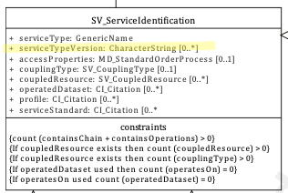

# Service Type Version  ★★ 

*When describing Spatial Services in a metadata record, it is useful to capture the type and version of the service in its commonly known name so as those who may wish to use the service can determine its campatibility to the desired purpose.*

|  |  |
| --- | --- |
| **Element Name** | *serviceTypeVersion* |
| **Parent** |  *[MD_Metadata.identificationInfo>SV_ServiceIdentification](./ServiceIdentification)* |
| **Class/Type** | *characterString* |
| **Governance** |  *Domain, Agency* |
| **Purpose** | *Discovery, Evaluation, Use* |
| **Audience** | machine resource - ⭑ ⭑ |
|  | general - ⭑ ⭑ ⭑|
|  | resource manager - ⭑ ⭑ ⭑|
|  | specialist - ⭑ ⭑ ⭑ |
|**Metadata type** | *descriptive* |
| **ICSM Level of Agreement**  | ⭑⭑⭑ | 

## Definition  
**The version of the service, supports searching based on the version of serviceType**

### ISO Requirements

There may be zero to many  [0..\*] *serviceTypeVersion* entries for the cited resource for a  *[SV_ServiceIdentification](./ServiceIdentification)* package of type *characterString*  in a metadata record.

## Discussion  
Many tools may be able to connect to and make use of only particular versions of a spatial service. For instance, some GIS tools may be able to consume WFS 1.1.0 but not WFS 2.0.0. Or the reverse may be true. Or the service may support multiple versions of the service type and standard. Providers of services should provide this information to those who may want to connect to such.

Detailed citation of such services, including linkages to the service standard itself or profile of such, should be captured in *[SV_ServiceIdentification.serviceStandard](./ServiceStandard)* or *[SV_ServiceIdentification.profile](./ServiceProfile)*.

## ICSM Recommendations 

Therefore - It is recommended that the *ServiceTypeVersion* be populated in service metadata records in such a way that discovery of services that adhere to a specific service type version can be found and filtered. It is particularly useful to capture here the multiple versions of a standard that the service may support.

## Outstanding Issues

> **Vocabularies for Service Type Version**
The version names available for a particular service type is limited. It would be useful if vocabularies were available that makes the selection of appropriate services, types and versions available to those populaing and validating these service metadata records


## Also Consider
There are many locations where service type and version information may be captured. Choose appropriately.

**[Service Type](./ServiceType)** The mandatory *serviceType* element should be populated with a value from managed controled vocabulary containing names for generic types of services. While ISO 19115-1 descibes these values as very specific (e.g. ‘discovery’, ‘view’, ‘download’, ‘transformation’, or ‘invoke') in practice, somewhat generic terms for spatial service standards are often used (e.g. OGC Web Map Service, OGC Web Coverage Service, Atom feed)

**[Service Standard](./ServiceStandard)** When a service conforms to a particular service standard that standard to which the service adheres should be cited

**[Service Profile](./ServiceProfile)**  When a service conforms to a particular profile of a service standard, the profile to which the service adheres should be cited (instead of the Service Standard)

**[Keywords (services)-](./Keywords)**  To enable ease of discovery, a service metadata record should contain at least one keyword of type *service*. The value of such keywords should refer to the service taxonomy defined in ISO 19119.

## Outstanding Issues

> **CORE ISSUE:**  
There is an apparrent incongruity in the definition of ServiceType and ServiceTypeVersion. While ServiceType is described as contain values of a very general nature, download, view, etc., ServiceTypeVersion is defined as a refinement of ServiceType. But generic terms like "download" do not have versions. In practice ServiceType is often populated with more specific terms like "OGC WMS" and ServiceTypeVersion may be "OGC WMS 1.4".

## Crosswalk Considerations 

#### ISO 19139/19119 
None known

#### Dublin core / CKAN / data.gov.au 
None known

#### DCAT 
None known

#### RIF-CS
{mapping to `RIF-CS element` and discussion, if any}


## Examples

### GA
{example - if any useful}

### ABARES
{example - if any useful}

### Others
{### who - example - if any useful}}

### XML -

```
<mdb:MD_Metadata>
....
  <mdb:identificationInfo>
   <srv:SV_ServiceIdentification>
      <mri:citation>
      ....
      </mri:citation>
      <mri:abstract/>
      <srv:serviceType>
         <gco:ScopedName>view</gco:ScopedName>
      </srv:serviceType>
      <srv:serviceTypeVersion>
         <gco:CharacterString>WFS 2.0.0</gco:CharacterString>
      </srv:serviceTypeVersion>
      <srv:serviceTypeVersion>
         <gco:CharacterString>WFS 1.1.0</gco:CharacterString>
      </srv:serviceTypeVersion>
      <srv:serviceTypeVersion>
         <gco:CharacterString>WFS 1.0.0</gco:CharacterString>
      </srv:serviceTypeVersion>
      ....
    </srv:SV_ServiceIdentification>
    ....
  </mdb:identificationInfo>
....
</mdb:MD_Metadata>
```

### UML diagrams

Recommended elements highlighted in Yellow



\pagebreak
