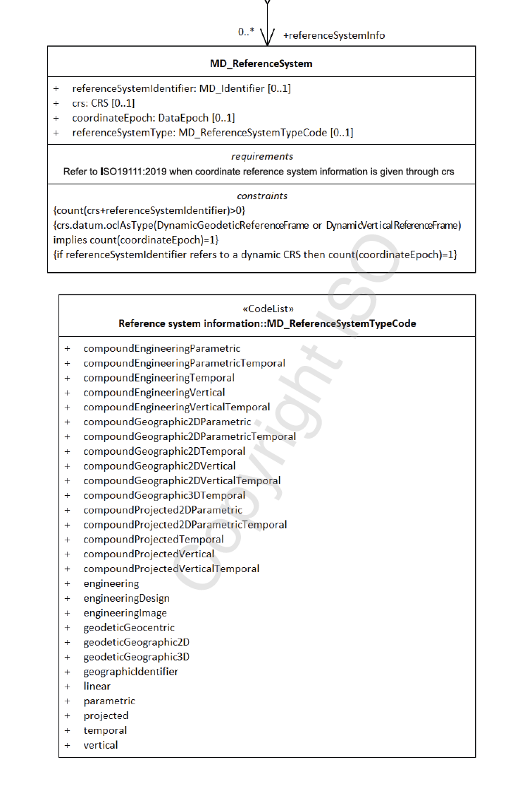

# Spatial Reference System ★★★★
*In order to be of repeatable use and combined with other resources, geospatial information is most always captured according to a [spatial reference system - (SRS)](https://www.w3.org/TR/sdw-bp/#dfn-coordinate-reference-system-(crs)). (Also referred to as a Coordinate Reference System - CRS.) Sharing the specifics of the reference systems used allows the resource to be compared and combined with others with precision and accuracy.*

|  |  |
| --- | --- |
| **Element Name** | *referenceSystemInfo* |
| **Parent** | *[MD_Metadata](./class-MD_Metadata)* |
| **Class/Type** | *MD_ReferenceSystem* |
| **Governance** |  *Common ICSM (for acceptable CRS registries)* | 
| | *Domain* (for acceptable values within a community of users) |
| **Purpose** | *Usage, Fitness* |
| **Audience** | machine resource - ⭑ ⭑ ⭑ ⭑ |
|  | general - ⭑ ⭑ |
|  | resource manager - ⭑ ⭑ ⭑ ⭑ |
|  | specialist - ⭑ ⭑ ⭑ ⭑ ⭑ |
| **Metadata type** | *Structural* |
| **ICSM Level of Agreement** | ⭑ ⭑ ⭑ |

## Definition
**Information about the framework reference systems used to precisely measure locations on the surface of the Earth as coordinates values.**

### ISO Obligation

- There should be zero or many [0..\*] *spatialReferenceInfo* packages for the cited resource in the  *[MD_Metadata](./class-MD_Metadata)* package of class *[MD_ReferenceSystem](http://wiki.esipfed.org/index.php/MD_ReferenceSystem)* in a metadata record for spatial resources.

## Discussion  

Note - The terms spatial reference and coordinate system used interchangeably. 

Geospatial resources require standardised spatial reference systems to provide a common, precise and decodable system for communicating real-world locations. Different spatial reference systems serve different purposes. People and machines that use spatial resources need to be provided in the metadata the details of the spatial reference systems used by the resource to conduct meaningful analysis and combine this resource with others.
 
To adequately describe a resource, there may be the need to include multiple SRS in the metadata. Usually, each would be of a different type (referenceSystemType).
 
 **Dynamic (Earth Centric) Datums**
A CRS contains two different elements - the datum and the coordinate system. The datum defines how the CRS is related to the Earth (position of the origin, the scale and the orientation of coordinate axis). The coordinate system describes how to express coordinate values. Datums may be static (tied to a plate on the Earth's crust), or dynamic (Earth-centric). With static datums, such as GDA94, coordinates do not change with time.

Real-world coordinates change over time due to movements in the Earth's crust. Modern Earth-centric datums, such as WGS84, account for these movements. These changes are significant and need to be accounted for when combining data captured at different times. For example, in Australia, continental drift accounts for up to 70mm per year or 1.8 metres over the past 26 years.

Therefore, when the SRS is dynamic, it is necessary to capture the coordinate observation's date (*Coordinate Epoch*) to understand coordinate values correctly. 

*Coordinate Epoch* values should be the year in decimal degrees of at least two decimal places for the value of the coordinate reference frame of the data captured. The *Coordinate Epoch* value depends on the methodology used. For instance, the Coordinate Epoch may be the date of coordinates capture for data captured using a GNSS device. On the other hand, for data digitised from imagery, the *Coordinate Epoch* value would be the date of the source imagery. Therefore, users must take care in determining the coordinate epoch of their source data or method.


## ICSM Best Practice Recommendations

Therefore, a record must include metadata about the Spatial Reference System used by this resource. Doing so will allow the proper use, reuse and analysis to occur. In addition, users need to know whether the CRS is dynamic or static. The minimum recommendation is to capture the reference system type and code (including codespace). When the datum is dynamic, record Coordinate Epoch to account for changes in coordinate positions due to movements in the earth's crust. 
 
 The European Petroleum Survey Group (EPSG) currently holds the most complete and frequently used register of SRSs. Therefore, we recommend using EPSG and the EPSG codespace for SRS information in the metadata.
 
 > **NOTE -** Authoritative hosting of the SRS registries is under review. This function may move to OGC, ISO in the near future.
 
 ### Recommended Sub-Classes
 * **referenceSystemIdentifier -** *(class - [MD_Identifier](./class-MD_Identifier))* mandatory - identifier, codespace and authority information for reference system
   * *code -* (type - charStr) mandatory - alphanumeric value identifying an instance in the namespace, e.g. '4283', '4326' . 
   * *codespace -* (type - charStr) [0..1] strongly recommended  - Identifier or namespace in which the code is valid, e.g. EPSG
   * *version -* (type - charStr) [0..1] optional - use if needed to distinguish a code
   * *description -* (type - charStr) [0..1]  optional - Common language description of the reference system, e.g. 'WGS84 - World Geodetic System 1984, used in GPS', 'NZTM'. For Coodinate Epoch this value should be "Decimal Year"
   * *authority -* (class - [CI_Citation](./class-CI_Citation)) [0..1] optional (GA, ABARES - conditional?) - Information about the party responsible for the spatial or temporal reference system used in this cited resource.
* **coordinateEpoch-** (class DataEpoch)[0..1] optional. Must be populated if the SRS datum is dynamic. The DataEpoch is the date in decimal year up to two decimal places.
 * **referenceSystemType -** (*codelist - [MD_ReferenceSystemTypeCode](http://wiki.esipfed.org/index.php/ISO_19115-3_Codelists#MD_ReferenceSystemTypeCode)*) [0 .. 1] strongly recommended - to describe the type of system used. 
 
### Related Codelists

**MD_ReferenceSystemTypeCode**

There are 28 options to choose from in the reference system type code list (MD_ReferenceSystemTypeCode). Many would never be used by a particular professional. The most common for most geospatial professionals is 'projected'. The list below sorts these options with the most common on top.

  * Common
    * **projected -** coordinate reference system derived from a two-dimensional geodetic coordinate reference system by applying a map projection e.g. easting, northing
    * **temporal -** reference system against which time is measured e.g. time
    * **vertical -** one-dimensional coordinate reference system based on a vertical datum (datum describing the relation of gravity-related heights or depths to the Earth) e.g. [gravity-related] height or depth
    * **geodeticGeographic2D -** geodetic CRS having an ellipsoidal 2D coordinate system e.g. latitude, longitude
    * **geodeticGeographic3D -** geodetic CRS having an ellipsoidal 3D coordinate system e.g. latitude, longitude, ellipsoidal height

  * Less common
    * **geodeticGeocentric -** geodetic CRS having a Cartesian 3D coordinate system e.g. [geocentric] X,Y,Z
    * **geographicIdentifier -** spatial reference in the form of a label or code that identifies a location e.g. post code
    * **linear -** reference system that identifies a location by reference to a segment of a linear geographic feature and distance along that segment from a given point e.g. x km along road

  * Specialised
    * *compoundGeographic2DTemporal* - compound spatio-temoral coordinate reference system containing a 2 dimensional geographic horizontal coordinate reference system and a temporal reference system e.g. latitude, longitude, time
    * *compoundGeographic2DVertical* - compound coordinate reference system in which one constituent coordinate reference system is a horizontal geodetic coordinate reference system and one is a vertical coordinate reference system e.g. latitude, longitude, [gravity-related] height or depth
    * *compoundGeographic2DVerticalTemporal* - compound spatio-temporal coordinate reference system containing a 2 dimensional geographic horizontal, a vertical, and a temporal coordinate reference system e.g. latitude, longitude, height, time
    * *compoundGeographic3DTemporal* - compound spatio-temporal coordinate reference system containing a 3 dimensional geographic and a temporal coordinate reference system e.g. latitude, longitude, ellipsoidal height, time
    * *compoundGeographic2DParametric* - compound statio-parametric coordinate reference system containing a 2 dimensional geographic horizontal coordinate reference system and a parametric reference system e.g. latitude, longitude, pressure
    * *compoundGeographic2DParametricTemporal* - compound statio-parametric-temporal coordinate reference system containing a 2 dimensional geographic horizontal, a parametric and a temporal coordinate reference system e.g. latitude, longitude, pressure, time
    * *compoundProjected2DParametric* - compound statio-parametric coordinate reference system containing a projected horizontal coordinate reference system and a parametric reference system e.g. easting, northing, density
    * *compoundProjected2DParametricTemporal* - compound statio-parametric-temporal coordinate reference system containing a projected horizontal, a parametric, and a temporal coordinate reference system e.g. easting, northing, density, time
    * *compoundProjectedTemporal* - compound spatio-temporal coordinate reference system containing a projected horizontal and a temporal coordinate reference system e.g. easting, northing, time
    * *compoundProjectedVertical* - compound spatial reference system containing a horizontal projected coordinate reference system and a vertical coordinate reference system e.g. easting, northing, [gravity-related] height or depth
    * *compoundProjectedVerticalTemporal* - compound spatio-temporal coordinate reference system containing a projected horizontal, a vertical, and a temporal coordinate reference system e.g. easting, northing, height, time
    * *engineering* - coordinate reference system based on an engineering datum (datum describing the relationship of a coordinate system to a local reference)e.g. [local] x,y
    * *engineeringDesign* - engineering coordinate reference system in which the base representation of a moving object is specified e.g. [local] x,y
    * *engineeringImage* - coordinate reference system based on an image datum (engineering datum which defines the relationship of a coordinate system to an image)e.g. row, column
    * *parametric* - coordinate reference system based on a parametric datum (datum describing the relationship of a parametric coordinate system to an object) e.g. pressure
    * *compoundEngineeringParametric* - compound spatio-parametric coordinate reference system containing an engineering coordinate reference system and a parametric reference system e.g. [local] x, y, pressure
    * *compoundEngineeringParametricTemporal* - compound spatio-parametric-temporal coordinate reference system containing an engineering, a parametric, and a temporal coordinate reference system e.g. [local] x, y, pressure, time
    * *compoundEngineeringTemporal* - compound spatio-temporal coordinate reference system containing an engineering and a temporal coordinate reference system e.g. [local] x, y, time
    * *compoundEngineeringVertical* - compound spatial reference system containing a horizontal engineering coordinate reference system and a vertical coordinate reference system e.g. [local] x, y, height
    * *compoundEngineeringVerticalTemporal* - compound spatio-temporal coordinate reference system containing an engineering, a vertical, and a temporal coordinate reference system e.g. [local] x, y, height, time

## Also Consider

- **[Spatial representation information](http://wiki.esipfed.org/index.php/ISO_Spatial_Representation)** *(class - [MD_SpatialRepresentation](http://wiki.esipfed.org/index.php/MD_SpatialRepresentation))* Not discussed by MDWG. Contains detailed information about digital mechanisms used to represent spatial information. Particularly useful for gridded data.

## Outstanding Issues
 
 > **Dynamic (Earth Centric) Datums** 
This guidance pertains to the recently released Amendment 2:2020 version of ISO19115-1 based metadata. As of this writing, no ISO19115-3 xml implementations are available. This work is dependent on the development of ISO19111 xml schemas currently underway. Until such efforts are complete refer to previous guidance for populating Spatial Reference System metadata. 

>**crs**
With the latest amendment came a new element, *crs*. This element references the class *CRS* from ISO19111. This element provides greater flexibility and additional details about reference frames. But until work is complete on an xml implementation of ISO19111, its use is not recommended.
 
 > **Authority**
 ABARES and GA marked *Authority* as a conditional field. But little guidance exists on the use of this element in this context. Should *Authority* be about the owner of the registry (e.g. EPSG) or the provider of the SRS (LINZ in the case of NZTM)?
 
 > **MD_ReferenceSystemTypeCode**
 The codelist *MD_ReferenceSystemTypeCode* is a long and confusing list of types that are not necessarily exclusive or distinguished by the same reasoning. Reconsideration of its use is recommended, particularly in light of the availability of the element *crs.datum.oclAsType* inherited from ISO19111. 
 
## Crosswalk considerations

<details>

### ISO19115-3 and ISO139

Fully forward compatible with previous versions

### Dublin core / CKAN / data.gov.au

No mapping provided

### DCAT

Maps to `dct:conformsTo`

### RIF-CS

Maps to the aggregate element `Coverage/Spatial`

</details>

## Examples

<details>

### XML

```
  TBC when available
```

### UML diagrams

Recommended elements highlighted in yellow



</details>

\pagebreak
