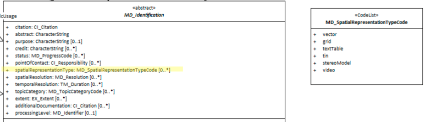

#  Spatial Representation Type ★★★★
*In order to quickly find, catagorise and evaluate the fitness of a resource to our needs it is useful to include in our metadata a high level description of the type or format of spatial data the resource contains.*

- **Path** - *MD_Metadata.identificationInfo>MD_DataIdentification.spatialRepresentationType*
- **Governance** -  *Common ICSM, Domain*
- **Purpose -** *discovery*
- **Audience -**
  - machine resource - ⭑⭑⭑
  - general - ⭑⭑⭑⭑
  - data manager - ⭑⭑⭑⭑
  - specialist - ⭑⭑⭑
- **Metadata type -** *structural*
- *ICSM Level of Agreement* - ⭑⭑⭑

## Definition
**The method used by the resource to spatially represent geographic information.**

### ISO Obligation

- There can be zero to many [0..\*] *spatialRepresentationType* entries for the cited resource in the  *[MD_DataIdentification](./class-MD_DataIdentification)* package selected from codelist *[MD_SpatialRepresentationTypeCode](http://wiki.esipfed.org/index.php/ISO_19115_and_19115-2_CodeList_Dictionaries#MD_SpatialRepresentationTypeCode)*.

### ICSM Good Practice

- At least one instance of this element should be populated in all metadata records containing spatial information.

#### Possible Values for *spatialRepresentationType*

From codelist - *[MD_SpatialRepresentationTypeCode](http://wiki.esipfed.org/index.php/ISO_19115_and_19115-2_CodeList_Dictionaries#MD_SpatialRepresentationTypeCode)(*)

- *vector -* vector data is used to represent geographic data
- *grid -* grid data is used to represent geographic data
- *textTable -* textual or tabular data is used to represent geographic data
- *tin -* triangulated irregular network
- *stereoModel -* three-dimensional view formed by the intersecting homologous rays of an overlapping pair of images
- *video -* scene from a video recording

## Discussion

A resource may consist of many spatial representation types. It may also contain no spatial representation types. Most commonly, a geospatial resource will consist of a single representation type.


## Recommendations

Therefore - If a resource contains spatial representations, to provide guidance to users, the type of spatial representation(s) should be captured using this element. Further Spatial representation details could be captured in the optional `spatialRepresentationInfo` package.

Values for this element must come from the MD_SpatialRepresentationTypeCode codelist.

### Crosswalk considerations

<details>

#### ISO19139

MD_DataIdentification/spatialRepresentationType moved from MD_DataIdentification to MD_Identification in order to allow their use for service identification. In practice, when creating metadata for data, this change is not noticable.

</details>

## Also Consider

- **[MD_Metadata.spatialRepresentationInfo](https://www.isotc211.org/hmmg/HTML/ConceptualModels/index.htm?goto=1:12:2:4095) -** Abstract class that decribes the digital mechanism used to represent spatial information. Not detailed by MDWG


## Examples

<details>

### XML -
```
<mdb:MD_Metadata>
....
  <mdb:identificationInfo>
    <mri:MD_DataIdentification>
    ....
      <mri:spatialRepresentationType>
        <mcc:MD_SpatialRepresentationTypeCode 
        codeList="https://schemas.isotc211.org/19115/resources/Codelist/cat
        /codelists.xml#MD_SpatialRepresentationTypeCode"
        codeListValue="vector"/>
      </mri:spatialRepresentationType>
    ....
    </mri:MD_DataIdentification>
  </mdb:identificationInfo>
....
</mdb:MD_Metadata>
```

### UML diagrams
Recommended elements highlighted in Yellow



</details>

\pagebreak
