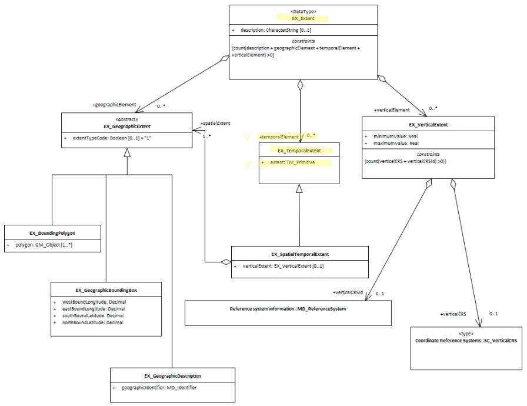

# Temporal Extents ★★★

*To quickly determine the temporal range of features included in an identified resource it is useful that the extent information include any temporal extents and limitations.*

| | |
| --- | --- |
| **Element Name** | *temporalElement* |
| **Parent** | *[MD_Metadata.identificationInfo>MD_Identification.extent](./ResourceExtent)* |
| **Class/Type** | *EX_TemporalExtent* |
| **Governance** | *Common ICSM, Domain* |
| **Purpose** | *Discovery* |
| **Audience** | machine resource - ⭑ ⭑ ⭑ ⭑ |
| | general - ⭑ ⭑ ⭑ ⭑ |
| | resource manager - ⭑ ⭑ |
| | specialist - ⭑ ⭑ ⭑ |
| **Metadata type** | *descriptive* |
| **ICSM Level of Agreement** | ⭑ ⭑ ⭑ |

## Definition
**This element provides a temporal component of the extent of the resource to aid discovery.**

### ISO Obligation

- There can be zero to many [0..\*] *temporalElements* packages for the cited resource in the *[Resource Extent](./ResourceExtent)* package of class *EX_TemporalExtent* for a cited resource. The attribute type is of class *[TM_Primitive](https://www.isotc211.org/hmmg/HTML/ConceptualModels/EARoot/EA1/EA8/EA1/EA1/EA2739.htm)*. Temporal Extents may be of type *Time instant*, *Time period*, *Time node*, or *Time edge*.

## Discussion

Every metadata record describing resources should describe the temporal validity of the resource. 

The use of multiple temporal extents is useful for describing more complicated resources. Where these are tied to and vary by spatial dimensions in the resource these may be expressed using EX_SpatialTemporalExtent.

With the advent of dynamic datums for high precision applications of spatial data, temporal information becomes even more important.

## ICSM Best Practice Recommendations

Therefore - it is strongly recommended that to support discovery of resources, and ensure the resource is fit to purpose, every metadata record contains, as needed, temporal extent description of the resource period of interest. Dates may be captured as type *date* or *datetTime* depending on your need and tools. If your data is of high precision then capture temporal extents to support dynamic datums. the capture of *timePeriod* information is highly recommended.

The MDWG recommends populating as many instances of temporalExtent packages as needed to give a common understanding of the temporal coverage of the cited resource.

### Recommended Temporal Extent types

* **Time instant -** *(class - gml:TimeInstance)* The instant is the 0-dimensional geometric primitive in time, equivalent to a point in space. An instant shall occupy a single temporal position in a given temporal reference system
* **timePosition -** *(type - date or dateTime)*
* **Time period -** *(class - gml:TimePeriod)* Mandatory elements are:
 * **beginPosition** *(type - date or dateTime)*
 * **endPosition** *(type - date or dateTime)*
 * **duration** *(type- duration)*
 * **timeInterval** *(type - decimal)*

 ## Also Consider

 - **[EX_Extent](./ResourceExtent)** The class that contains all extent information about the cited resource - vertical, geographical or temporal.
 - **EX_GeographicExtents** is an abstract class that can be express three ways:
  - **[EX_GeographicBoundingBox -](./ExtentBoundingBox)** at least one of these should be present for resources that describe geographic resources
  - **[EX_GeographicDescription -](./ExtentGeographicDescription)** One of these should be present for resources that describe geographic resources
  - **EX_BoundingPolygon** While very useful, particularly in describing irregular areas, this element is not described by the MDWG as a recommended element due to the difficulties that many systems have in implementing it.
 - **[EX_VerticalExtent -](./VerticalExtent)** captures the vertical range of a resource.

 ## Outstanding Issues

 > Our understanding of temporal metadata is poor and the documentation of such is weak and by reference in ISO19115-1. There is the use of GML elements when these are described as being TM_Primitives. What is the relation? Also, What about Time node and Time edge? Need help with this timey whimey stuff.


## Crosswalk considerations

<details>

### Dublin core / CKAN / data.gov.au {if any}

Mapping to CKAN and Dublin core elements, particularly as used by data.gov.au needs discussion

</details>

## Examples

<details>

### XML
```
<mdb:MD_Metadata>
....
  <mdb:identificationInfo>
   <mri:MD_DataIdentification>
     ....
     <mri:extent>
      <gex:EX_Extent>
        <gex:temporalElement>
         <gex:EX_TemporalExtent>
           <gex:extent>
            <gml:TimePeriod gml:id="d5078594e414a1056030">
              <gml:begin>
               <gml:TimeInstant gml:id="d5078594e416a1056030">
                 <gml:timePosition>2019-07-01</gml:timePosition>
               </gml:TimeInstant>
              </gml:begin>
              <gml:end>
               <gml:TimeInstant gml:id="d5078594e420a1056030">
                 <gml:timePosition>2019-07-31</gml:timePosition>
               </gml:TimeInstant>
              </gml:end>
            </gml:TimePeriod>
           </gex:extent>
         </gex:EX_TemporalExtent>
        </gex:temporalElement>
      </gex:EX_Extent>
     </mri:extent>
   ....
   </mri:MD_DataIdentification>
  </mdb:identificationInfo>
....
</mdb:MD_Metadata>
```

\pagebreak

### UML diagrams

Recommended elements highlighted in yellow



</details>

\pagebreak


