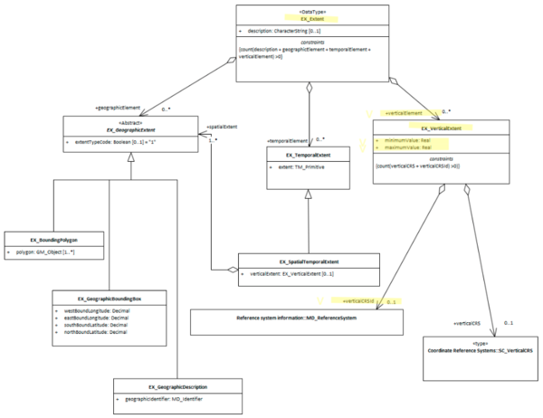

# Vertical Extent ★★★

*To quickly determine the general location of features included in an identified resource it is useful that the extent information include any descriptions vertical extents.*

| | |
| --- | --- |
| **Element Name** | *verticalElement* |
| **Parent** |*[MD_Metadata.identificationInfo>MD_Identification.extent](./ResourceExtent)* |
| **Class/Type** | *EX_VerticalExtent* |
| **Purpose** | *Discovery* |
| **Audience** | machine resource - ⭑ ⭑ ⭑ ⭑ |
| | general - ⭑ ⭑ ⭑ ⭑ |
| | resource manager - ⭑ ⭑ |
| | specialist - ⭑ ⭑ ⭑ (higher if domain specific time periods are used) |
| **Metadata type** | *descriptive* |
| **ICSM Level of Agreement** | ⭑ ⭑ ⭑ |

## Definition
**Provides vertical component of the extent of the resource to aid discovery.**

### ISO Obligation

- There can be zero to many [0..\*] *verticalElements* packages for the cited resource in the *[Resource Extent](./ResourceExtent)* package of class *[EX_VerticalExtent](http://wiki.esipfed.org/index.php/EX_VerticalExtent)* for a resource cited in a metadata record. 

## Discussion

Every metadata record describing resources which contain height or depth information should describe the limits of that extent. These extents descriptions should include units of measure and other information so that those searching for resources can be provided with a quick idea of the vertical range of the resource. 

The use of multiple vertical extents is useful for describing more complicated resources.

## ICSM Recommendations

Therefore - it is strongly recommended that to support the discovery of resources, every metadata record contains, as needed vertical extent description of the resource area of interest. Capture the units of measure and the datum used.

The MDWG recommends, when the heights and depths of a resource are important to the resource, populating as many instances of Vertical Extent packages as needed to give a common understanding of the depth and elevation coverage of the cited resource.

### Recommended Sub-Elements

- **minimumValue -** *(type - Real)* The minimum vertical extent to which the resource is designed to be used
- **maximumValue -** *(type - Real)* The maximum vertical extent to which the resource is designed to be used
- **verticalCRSId -** *(class - [SC_VerticalCRS](http://wiki.esipfed.org/index.php/VerticalCRS)
)* Identifies the vertical coordinate reference system used for the minimum and maximum values

## Also Consider

- **[EX_Extent](./ResourceExtent)** The class that contains all extent information about the cited resource - vertical, geographical or temporal.
- **EX_GeographicExtents** is an abstract class that can be express three ways:
 - **[EX_GeographicBoundingBox -](./ExtentBoundingBox)** at least one of these should be present for resources that describe geographic resources
 - **[EX_GeographicDescription -](./ExtentGeographicDescription)** One of these should be present for resources that describe geographic resources
 - **EX_BoundingPolygon** While very useful, particularly in describing irregular areas, this element is not described by the MDWG as a recommended element due to the difficult that many systems have in implementing it.
- **[EX_TemporalExtent](./TemporalExtents)** Contains temporal extent information for the cited resource

## Outstanding Issues

> **verticalCRS**
The vertical CRS can be captured here or under the SpatialRefenceSystem package. We need to decide when to recommend capturing it here. As other extent parameters do not include the CRS, I would make a recommendation that we treat vertical the same and capture this info in the SRS section.
> Note BC 21-9: GN in the 19115-3 plugin captures the extent info as the old RS_Identifier instead of MD_Identifier

> **Units of measure**
These are not specified. I would suggest that we use metres relative to sea level WGS 84 as the universal units for vertical extents. As with the mandate of WGS 84 for the projection for bounding box extents, it is important to have as a close to a universally common reference frame as we can get to compare disparate resources.

> **Datum Issues**
What is "zero" is an open question. There may be little common between domains. In 3D cadastre, the level above ground may be the measure. There also is no agreement between land vertical datums and those for the sea.

## Crosswalk considerations

<details>

### Dublin core / CKAN / data.gov.au

Mapping to CKAN and Dublin core elements, particularly as used by data.gov.au needs discussion

### DCAT

Maps to `dct.spatial`

### RIF-CS

Maps to `Coverage/Spatial`

</details>

## Examples

<details>

### XML

```
<mdb:MD_Metadata>
....
  <mdb:identificationInfo>
   <mri:MD_DataIdentification>
     ....
     <mri:extent>
      <gex:EX_Extent>
        <gex:verticalElement>
         <gex:EX_VerticalExtent>
           <gex:minimumValue>
            <gco:Real>-1000</gco:Real>
           </gex:minimumValue>
           <gex:maximumValue>
            <gco:Real>1000</gco:Real>
           </gex:maximumValue>
           <gex:verticalCRSId>
            <mrs:MD_ReferenceSystem>
              <gmd:referenceSystemInfo xmlns:gmd="http://www.isotc211.org/2005/gmd">
               <gmd:MD_ReferenceSystem>
                 <gmd:referenceSystemIdentifier>
                  <gmd:RS_Identifier>
                    <gmd:code>
                     <gco:CharacterString 
                     xmlns:gco="http://www.isotc211.org/2005/gco">
                     WGS 84 (EPSG:4326)</gco:CharacterString>
                    </gmd:code>
                    <gmd:codeSpace>
                     <gco:CharacterString 
                     xmlns:gco="http://www.isotc211.org/2005/gco">
                     EPSG
                     </gco:CharacterString>
                    </gmd:codeSpace>
                    <gmd:version>
                     <gco:CharacterString 
                     xmlns:gco="http://www.isotc211.org/2005/gco">
                     8.6
                     </gco:CharacterString>
                    </gmd:version>
                  </gmd:RS_Identifier>
                 </gmd:referenceSystemIdentifier>
               </gmd:MD_ReferenceSystem>
              </gmd:referenceSystemInfo>
            </mrs:MD_ReferenceSystem>
           </gex:verticalCRSId>
         </gex:EX_VerticalExtent>
        </gex:verticalElement>
      </gex:EX_Extent>
     </mri:extent>
   ....
   </mri:MD_DataIdentification>
  </mdb:identificationInfo>
....
</mdb:MD_Metadata>
```

\pagebreak

### UML diagrams

Recommended elements highlighted in yellow



</details>

\pagebreak

