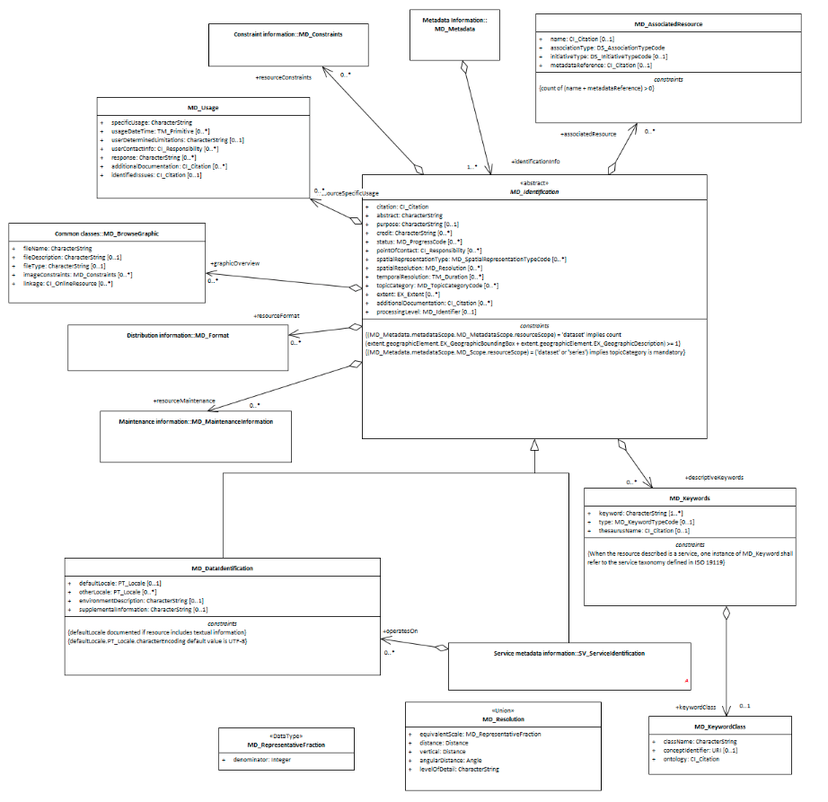

#  Class (abstract) - MD_Identification
*When capturing information on a spatial resource, it is important to identify and categorise information as pertaining to the data or service resource and to distinguish these information from that which applies to the metadata itself. MD_Identification provide a abstract package, the properties of which can be expressed for data (MD_DataIdentification) or service SV_ServiceIdentification) resources.*

- **Governance** -  *ISO*
- **Metadata Type -** *structural*
- *ICSM Level of Agreement* - ⭑

## Definition

**basic information required to uniquely identify a resource or resources.**

### ISO Requirements
At least one [1..\*] [MD_Identification](http://wiki.esipfed.org/index.php/MD_Identification)  must be present in a metadata record. This must be instantiated as a `MD_DataIdentification` or `SV_ServiceIdentification` instance.

### ISO Associations

**[MD_Identification](http://wiki.esipfed.org/index.php/MD_Identification)** is an abstract class that can be instantiated as either

- MD_DataIdentification
- SV_ServiceIdentification

It is a child of 

- MD_Metadata.identificationInfo

### Child packages  -

#### Concrete subsclasses of MD_Identification

- **Data Identification -** *(class MD_DataIdentification)* > ?create Entry?
- **Service Identification -** *(class SV_ServiceIdentification)* > To Be Completed at later date

#### MDWG recommended MD_Identification packages

One of 

- **[Data Identification -](./class-MD_DataIdentification)** *(class MD_DataIdentification)* 

or

- **[Service Identification -](./ServiceIdentification)** *(class SV_ServiceIdentification)* 

Plus the following:

- **[Extents -](./ResourceExtent)** *(class - [EX_Extent](http://wiki.esipfed.org/index.php/EX_Extent))* [0..\*]  High-level thematic classifications to assist in the grouping and searching of data.
- **[referenceSystemInfo -](https://www.loomio.org/d/4SliNjWE/md_metadata-md_referencesystem-definition)** *(class - MD_ReferenceSystem)*
- **resourceConstraints -** *( abstract class [MD_Constraints](./class-MD_Constraints))* [0..\*] see
- **[Resource Security Constraints](./ResourceSecurityConstraints)**
- **[Recource Legal Constraints](./ResourceLegalConstraints)** 
- **[Recource Other Constraints](./ResourceOtherConstraints)** 
- **[Spatial Resolution](./SpatialResolution) -**  *(class - [MD Resolution](http://wiki.esipfed.org/index.php/MD_Resolution))* [0..\*] 
- **[Resource Lineage -](./ResourceLineage)** *(class - Li_Lineage)* [0..\*]

#### Other packages - not yet addressed by MDWG

- **resourceMaintenance -** *(class MD_MaintenanceInformation)* [0..1]
- **spatialRepresentationInfo -** *(abstract class - MD_SpatialRepresentation)* [0..\*]
- **applicationSchemaInfo -** *(class - MD_ApplicationSchemaInformation)* [0..\*]
- **portrayalCatalogInfo -** *(class - MD_ProtrayalCatalogueReference)* [0..\*]
- **contentInfo -** *(abstract class - MD_ContentInformation)* [0..\*]
- **dataQualityInfo -** *(class - DQ_DataQuality (from ISO19157))* [0..\*]

### Atributes and packages

#### MDWG Recommended

Click on the attribute name for guidance.

- **[Citation -](./ResourceCitation)** *(class - [CI_Citation](./class-CI_Citation) [1..1] - Citation for the resource, includes name, publication date, identifiers, originators and publishers.
- **[abstract -](./Abstract)** *(type - charStr)* [1..\*] - A brief narrative summary of the cited resource.
- **[purpose -](./Purpose)** *(type - charStr))* [0..1] - A brief summary of the intentions with which the resource was developed
- **[status -](./Status)** *(codelist - [MD_ProgressCode](http://wiki.esipfed.org/index.php/ISO_19115_and_19115-2_CodeList_Dictionaries#MD_ProgressCode))* [0..1] - The status of the resource populated from a domain of values
- **[topicCategory -](./TopicCategory)** *(enumeration - [MD_TopicCategoryCode](http://wiki.esipfed.org/index.php/ISO_19115_and_19115-2_CodeList_Dictionaries#MD_TopicCategoryCode))* [0..\*] - The main themes of the resource populated from a fixed domain of values
- **[pointOfContact -](./ResourcePointOfContact)** *(class -  [CI_Responsibility](./class-CI_Responsibility))* [0..1] - The name and contact information for the organisation, role and/or individual that serves as the point of contact for the cited resource.
- **[spatialRepresentationType -](./SpatialRepresentationType)** *(codelist - MD_SpatialRepresentationTypeCode)* [0..\*] - The method used by the resource to spatially represent geographic information.
- **[spatialResolution -](./SpatialResolution)** *(class - MD_Resolution)* [0..\*] - The nominal scale and/or spatial resolution at which the resource is designed to be used.
- **[graphicOverview -](./BrowseGraphic)** *(class - MD_BrowseGraphic)* [0..\*] - A graphic that provides an lightweight illustration pertaining a resource
- **[additionalDocumentation](./AdditionalDocs) -**  *(class - [CI_Citation](./class-CI_Citation))* [0..\*] - Citation of other documentation associated with the resource, e.g. related articles, publications, user guides, data dictionaries.
- **[associatedResource](./AssociatedResources) -**  *(class - [MD AssociatedResource](http://wiki.esipfed.org/index.php/MD_AssociatedResource))* [0..\*] - Used to indicate association between resources and records related to the resources

#### Others - not yet addressed by MDWG

- **credit -** *(type - charStr)* [0..\*] Recognition of those who contributed to the dataset. Do not include URLs here. Provide full citations in MD_AssociatedResource section.
- **temporalResolution -** *(class - [TM_PeriodDuration](http://wiki.esipfed.org/index.php/TM_PeriodDuration)* [0..\*]   The temporal resolution (level of temporal detail) of the dataset.
- **processingLevel -** *(class - [MD_Identifier](./class-MD_Identifier))* [0..\*]   An identifier code that identifies the level of processing in the producers coding system.
- **resourceSpecificUsage -** *(class - [MD_Usage](http://wiki.esipfed.org/index.php/MD_Usage))* [0..\*] Basic information about specific application(s) for which the resource(s) has been or is being used by different users.

## Discussion

Identification information about a resource is of high importance to document as this information strongly impacts on the ability of a user to asses the resource fitness to use. The **identificationInfo** package must be of either type *data*  (*MD_DataIdentification*) or *service* (*SV_ServiceIdentification*).

## Recommendations 

There must be at least one (and usually just one) `identificationInfo` packages in a metadata record that contains the substantive  information about a cited resource.

## Related Classes

- **[MD_DataIdentification](./class-MD_DataIdentification)** An instantiation of the abstract calss for data resource metadata

\pagebreak

### UML diagrams

Recommended elements highlighted in yellow

\pagebreak
