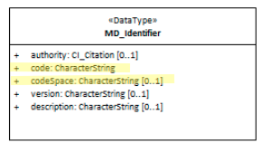

# class - MD_Identifier

In order for machines and people to distinguish singlton elements cited a Metadata record [MD_Metadata](http://link.to.MD_Metadata) , a method to provide a unique identifier. 

- **Governance** -  *ISO*
- **Metadata type -** *administrative*
- *ICSM Level of Agreement* - ⭑⭑

## Definition
**Provides a value uniquely identifying an object within a namespace**

### ISO Associations

- MD_Metadata.metadataIdentifier
- MD_ReferenceSystem.referenceSystemIdentifier
- MD_Medium.identifier
- MD_RangeDimension.name
- MD_ImageDescription.imageQualityCode
- MD_CoverageDescription.processingLevelCode
- EX_GeographicDescription.geographicIdentifier
- CI_Citation.identifier 
- CI_Party.PartyIdentifier

#### Sub Elements for class MD_Identifier

- **code -** (*type - charStr*) [1..1] alphanumeric value identifying an instance in the namespace, mandatory when identifier is provided
- **codespace -** *(type - charStr)* [0..1] identifier or namespace in which the code is valid. Usually a URL path which, when combined with the id, creates a resolvable (dereferencable) URI.
- **authority -** *(class CI_Citation)* [0..1] the provider of the id
- **version -** (*type - charStr*) [0..1] version identifier for the namespace
- **description -** (*type - charStr*) [0..1] natural language description of the meaning of the code value

## Discussion 
#### authorities as agents
Some metadata implementations use system information in the **authority** field however *authority* implies agency and the CI_Citation object makes it clear an *agent* (person or, more likely an organisation) should be recorded here, not a system.

#### indicating authorities
Resolvable identifiers (URIs) for **authority** likely of interest to MDWG members have been established using persistent identifiers by the [Australian Government Linked Data Working Group](http://www.linked.data.gov.au) for use in this field:

* <http://linked.data.gov.au/org/ausgin> - Australian Geoscience Information Network. Authorises use of `pid.geoscience.gov.au`-based URIs
* <http://linked.data.gov.au/org/agldwg> - Australian Government Linked Data Working Group. Authorises use of `linked.data.gov.au`, the Australian government's departmentally-independent URI domain allocated for persistent data identifiers
* <http://linked.data.gov.au/org/doi> - Digital Object Identifier System. The international not-for-profit membership organization providing Digital Object Identifier (DOI)s used for documents and data
* <http://linked.data.gov.au/org/handle> - the general-purpose digital object identifier system used by amny other systems
* <http://linked.data.gov.au/org/igsn> - International Geo Sample Number. The non-profit consortium managing unique identifiers for samples and specimens collected from our natural environment
* <http://linked.data.gov.au/org/psma> - PSMA Australia. Issues identifiers for street addresses in Australia
* <http://linked.data.gov.au/org/ror> - Research Organization Registry Community. A community-led project to develop an open, sustainable, usable, and unique identifier for every research organization in the world

These identifiers may be used in appropriate **authority** fields (i.e. with a `CI_Citation` XML block) to better indicate authority agencies than either a (likely short-lived) website address or just the name of them in text and street address/phone contact information and so on.

More identifiers for more authorities can be added uplon request to the AGLDWG.

## Recommendations

It is recommended that the MDWG develop general advise on the use of MD_Identifier - particularly concerning the use of `<mcc:codespace>`  and leverage the ability of combining this element with its mandatory sibling element `<mcc:code>` to provide a linkage to a cited resource. It would also be beneficial to discuss other sibling elements `<mcc:authority>`, `<mcc:version>` and `<mcc:description>` and develop any needed advice on their general use.

### UML diagrams

Recommended elements highlighted in Yellow

\pagebreak
